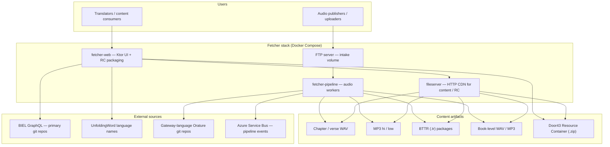
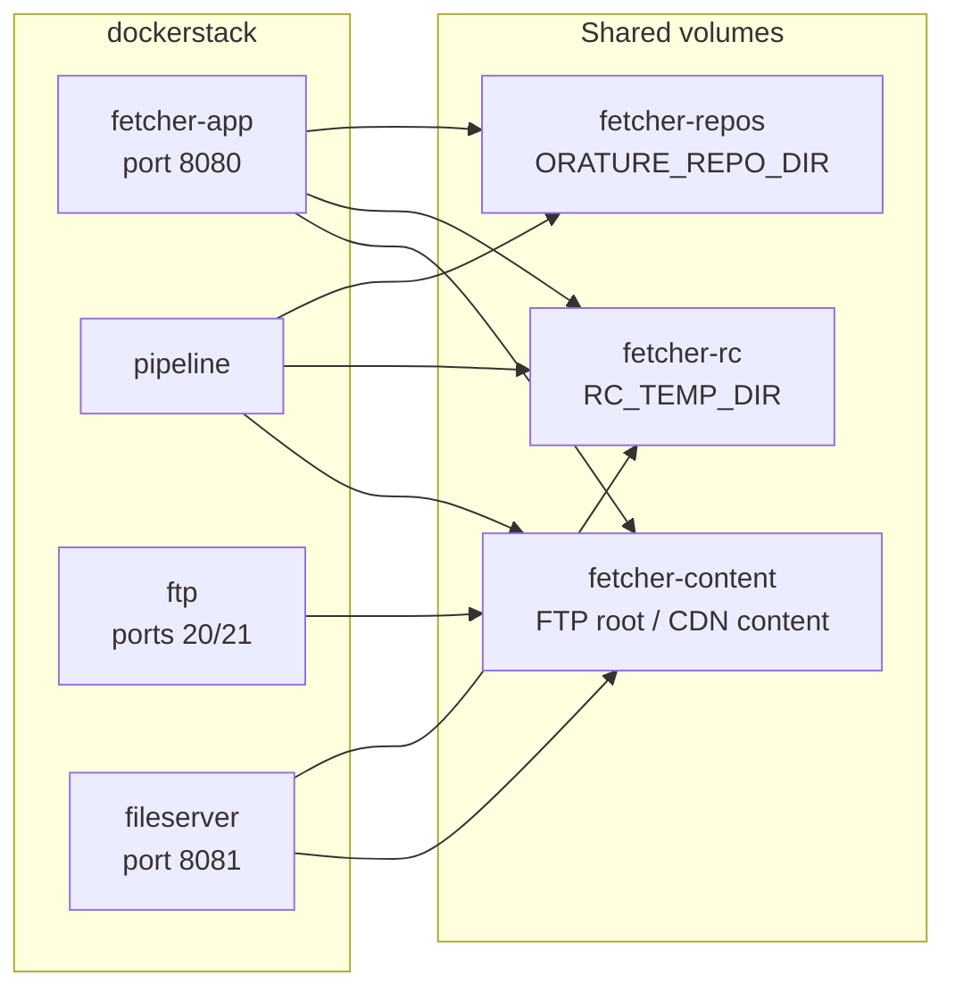
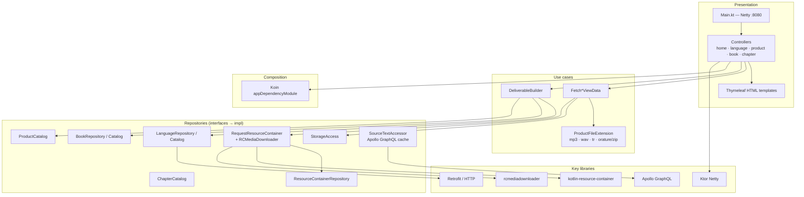
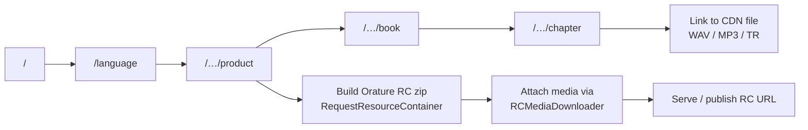
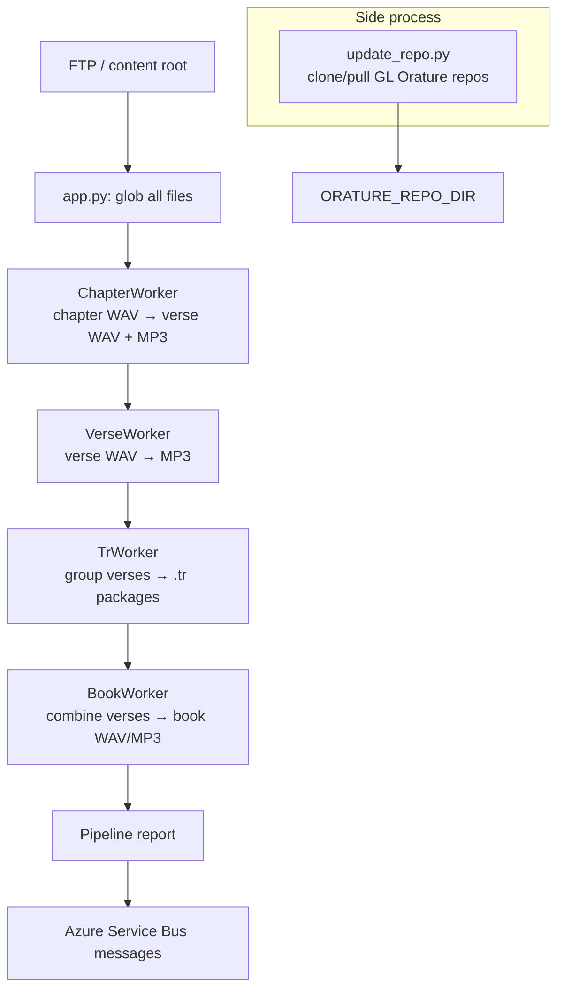

# Fetcher architecture

[Fetcher](https://github.com/Bible-Translation-Tools/Fetcher) is an app/library for downloading scripture **source audio** for translation. It is a Docker-composed system: a **Kotlin/Ktor web UI** that browses and packages audio into Resource Containers, a **Python pipeline** that processes uploaded WAV into MP3 / TR / book artifacts, an **FTP** intake, and a **CDN-style file server**.

Default branch in this org listing: `audio.bibleineverylanguage.org`.

## System context

## Deployed services & volumes

## `fetcher-web` layering

## Browse & download flow

User navigation mirrors scripture hierarchy: language → product (file type) → book → chapter. Chapter pages point at CDN URLs under `CDN_BASE_URL`; Orature products assemble Resource Containers under `CDN_BASE_RC_URL` / `RC_TEMP_DIR`, using template RCs from storage and media from the content tree.

## Pipeline workers

Workers run on a timer (`-hr` / `-mn`), share a mutable set of paths across a cycle, and skip unchanged files via content hashes. Tools under `fetcher-pipeline/tools` handle splitting, MP3 conversion, and TR creation (Java/Node helpers alongside Python).

## Design notes

| Topic | Approach |
|--------|----------|
| **Purpose** | Browse and download source audio (and Orature RCs) for translation; process uploaded chapter/verse WAV into CDN-ready formats. |
| **Web stack** | Kotlin 11, Ktor + Netty, Thymeleaf, Koin DI, Shadow JAR (`bible-translation-tools_fetcher.jar`). |
| **Pipeline stack** | Python 3.8+, scheduled workers; depends on Java 11 and Node 14 for conversion tools. |
| **Products** | `mp3`, `wav`, `tr` (BTTR), `orature` (RC zip). |
| **Languages** | UnfoldingWord catalogs for gateway (GL) and heart (HL) languages; UI i18n via Crowdin. |
| **Source text / RCs** | Primary git repos from BIEL GraphQL; RC packaging with `kotlin-resource-container` + `rcmediadownloader`. |
| **Ops** | Root `makefile` builds both images and runs `dockerstack`; images published via GitHub Actions. |

## Related repositories

- Source: [Bible-Translation-Tools/Fetcher](https://github.com/Bible-Translation-Tools/Fetcher)
- Companion consumer: [Bible-Translation-Tools/Orature](https://github.com/Bible-Translation-Tools/Orature) (imports Resource Containers with source audio)
- Resource Container spec: [Door43 Resource Container](https://resource-container.readthedocs.io/)
