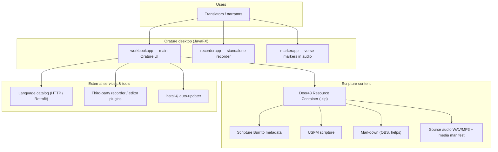
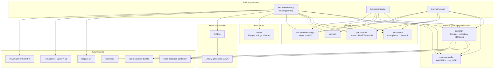
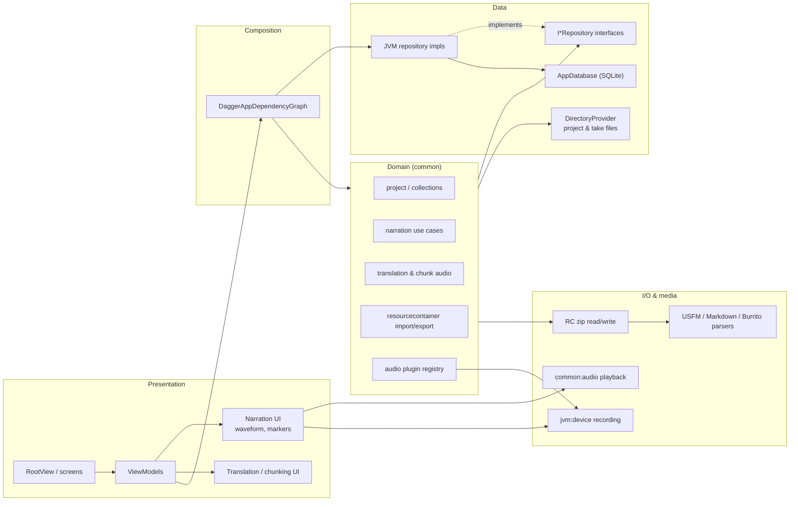

# Orature architecture

[Orature](https://github.com/Bible-Translation-Tools/Orature) is a desktop application for oral Bible drafting, narration, and translation. The Gradle project is named **otter** (Oral Translation Tools and Resources). The codebase is split into **Common** (shared logic for desktop and future Android) and **JVM** (JavaFX desktop implementation).

## System context

## Gradle modules & layering

## Runtime flow inside `workbookapp`

## Design notes

| Topic | Approach |
|--------|----------|
| **Platforms** | Interfaces and domain logic live in `common`; JVM-specific code (JavaFX, SQLite repos, filesystem) lives under `jvm`. |
| **UI stack** | JavaFX 21, TornadoFX, MaterialFX / JFoenix controls, RxJava for async streams. |
| **Projects** | Imported/exported as Resource Containers; supports Burrito metadata, USFM, Markdown, and container-local source audio. |
| **State** | Workbooks, takes, resources, languages, and preferences persisted in SQLite via JOOQ. |
| **Extensibility** | YAML-defined **audio plugins** launch external recorders/editors; `workbookplugin` shares plugin UI across apps. |
| **Build / ship** | Gradle wrapper (`./gradlew run`); installers via install4j (Windows, Linux, macOS). |

## Related repositories

- Source: [Bible-Translation-Tools/Orature](https://github.com/Bible-Translation-Tools/Orature)
- Product info: [bibletranslationtools.org — Orature](https://bibletranslationtools.org/tool/orature/)
- Resource Container spec: [Door43 Resource Container](https://resource-container.readthedocs.io/)
