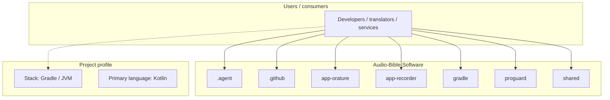
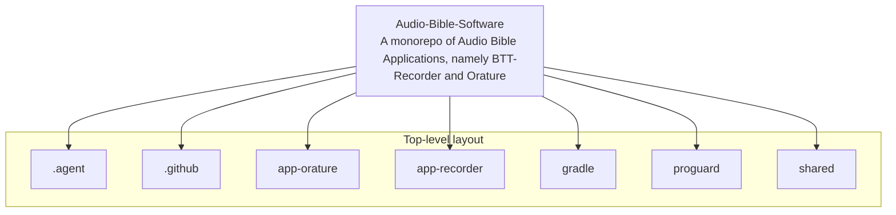
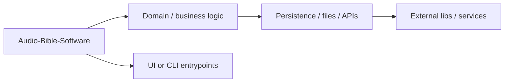

# Audio-Bible-Software architecture

[Bible-Translation-Tools/Audio-Bible-Software](https://github.com/Bible-Translation-Tools/Audio-Bible-Software) — A monorepo of Audio Bible Applications, namely BTT-Recorder and Orature.

This is a Kotlin Multiplatform project targeting Android, Desktop.

## System context

## Repository structure

**Directories:** `.agent`, `.github`, `app-orature`, `app-recorder`, `gradle`, `proguard`, `shared`

**Notable files:** `.gitattributes`, `.gitignore`, `build.gradle.kts`, `gradle.properties`, `gradlew`, `gradlew.bat`, `LICENSE`, `README.md`, `settings.gradle.kts`

## Runtime / integration sketch

> This diagram is inferred from repository layout, languages, and README. It is a starting map, not a full design review.

## Languages

| Language | Approx. file count |
|----------|-------------------|
| Kotlin | 579 files |
| XML | 22 files |
| Gradle | 3 files |
| SQL | 2 files |
| Batch | 1 files |

## Design notes

| Topic | Detail |
|--------|--------|
| **Stack** | Gradle / JVM |
| **Default branch** | `main` |
| **Org** | Bible-Translation-Tools |

## Related

- Source: [Bible-Translation-Tools/Audio-Bible-Software](https://github.com/Bible-Translation-Tools/Audio-Bible-Software)
- Branch analyzed: `main`
