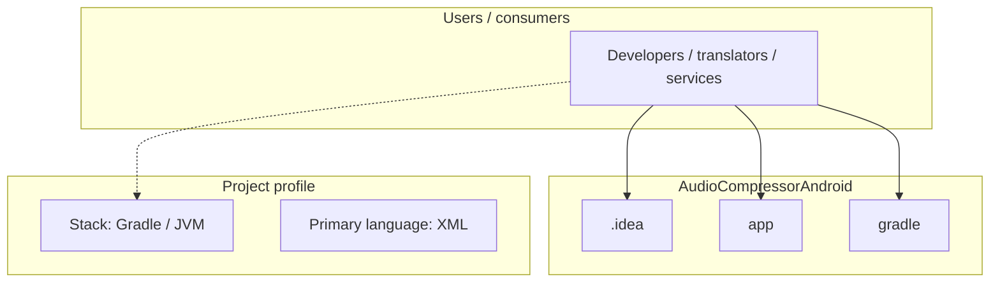
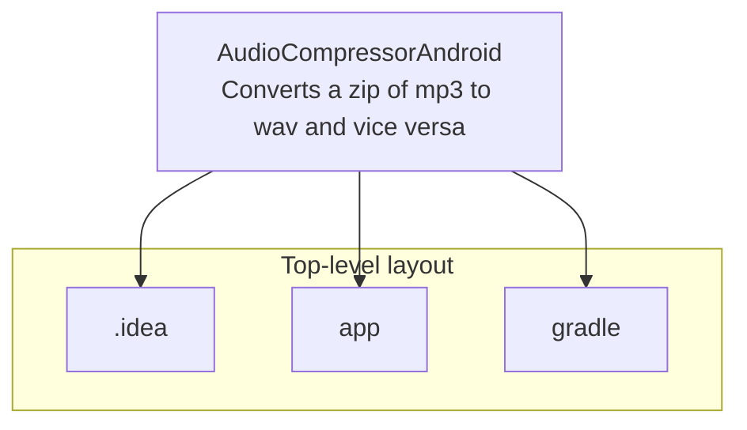
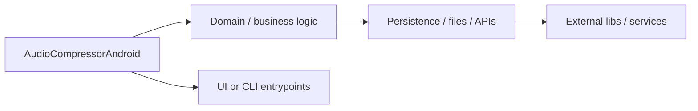

# AudioCompressorAndroid architecture

[Bible-Translation-Tools/AudioCompressorAndroid](https://github.com/Bible-Translation-Tools/AudioCompressorAndroid) — Converts a zip of mp3 to wav and vice versa.

Converts a zip of mp3 to wav and vice versa

## System context

## Repository structure

**Directories:** `.idea`, `app`, `gradle`

**Notable files:** `.gitattributes`, `.gitignore`, `build.gradle`, `gradle.properties`, `gradlew`, `gradlew.bat`, `LICENSE`, `settings.gradle`

## Runtime / integration sketch

> This diagram is inferred from repository layout, languages, and README. It is a starting map, not a full design review.

## Languages

| Language | Approx. file count |
|----------|-------------------|
| XML | 11 files |
| Kotlin | 7 files |
| Gradle | 3 files |
| Batch | 1 files |

## Design notes

| Topic | Detail |
|--------|--------|
| **Stack** | Gradle / JVM |
| **Default branch** | `master` |
| **Org** | Bible-Translation-Tools |

## Related

- Source: [Bible-Translation-Tools/AudioCompressorAndroid](https://github.com/Bible-Translation-Tools/AudioCompressorAndroid)
- Branch analyzed: `master`
