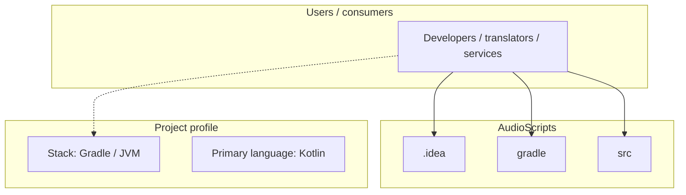
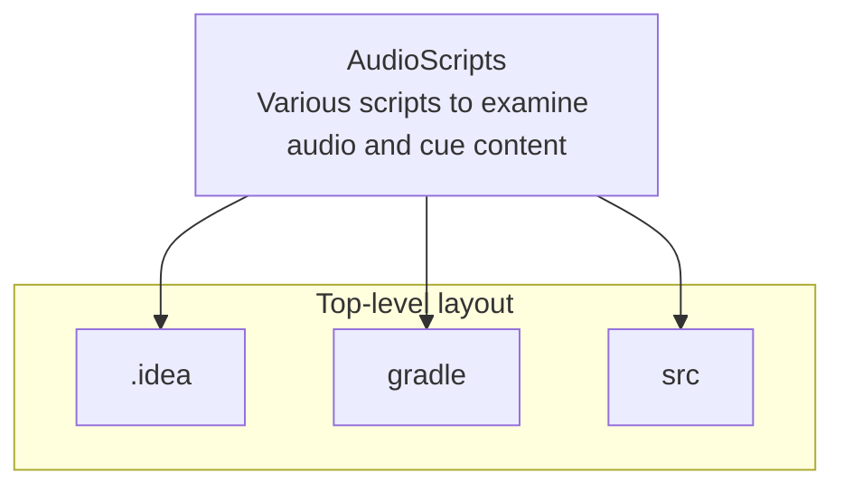
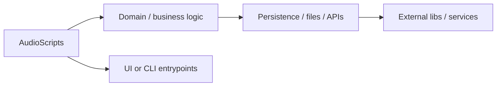

# AudioScripts architecture

[Bible-Translation-Tools/AudioScripts](https://github.com/Bible-Translation-Tools/AudioScripts) — Various scripts to examine audio and cue content.

Various scripts to examine audio and cue content

## System context

## Repository structure

**Directories:** `.idea`, `gradle`, `src`

**Notable files:** `.gitattributes`, `.gitignore`, `build.gradle`, `gradle.properties`, `gradlew`, `gradlew.bat`, `LICENSE`, `results.json`, `settings.gradle`

## Runtime / integration sketch

> This diagram is inferred from repository layout, languages, and README. It is a starting map, not a full design review.

## Languages

| Language | Approx. file count |
|----------|-------------------|
| Kotlin | 9 files |
| Gradle | 2 files |
| Batch | 1 files |

## Design notes

| Topic | Detail |
|--------|--------|
| **Stack** | Gradle / JVM |
| **Default branch** | `main` |
| **Org** | Bible-Translation-Tools |

## Related

- Source: [Bible-Translation-Tools/AudioScripts](https://github.com/Bible-Translation-Tools/AudioScripts)
- Branch analyzed: `main`
