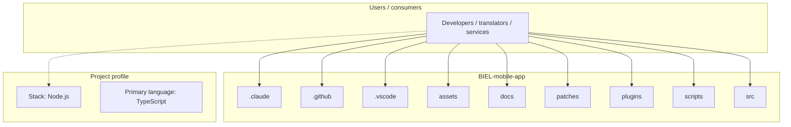
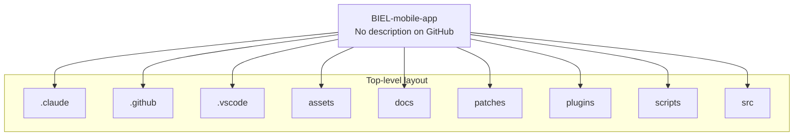
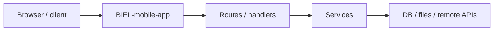

# BIEL-mobile-app architecture

[Bible-Translation-Tools/BIEL-mobile-app](https://github.com/Bible-Translation-Tools/BIEL-mobile-app) — _no GitHub description_.

Expo (SDK 55) app using [Expo Router](https://docs.expo.dev/router/introduction/) with routes in `src/app/`.

## System context

## Repository structure

**Directories:** `.claude`, `.github`, `.vscode`, `assets`, `docs`, `patches`, `plugins`, `scripts`, `src`

**Notable files:** `.gitignore`, `.npmrc`, `app.json`, `eslint.config.js`, `index.js`, `package.json`, `pnpm-lock.yaml`, `pnpm-workspace.yaml`, `README.md`, `tsconfig.json`, `vitest.config.ts`

## Runtime / integration sketch

> This diagram is inferred from repository layout, languages, and README. It is a starting map, not a full design review.

## Languages

| Language | Approx. file count |
|----------|-------------------|
| TypeScript | 141 files |
| JavaScript | 5 files |
| YAML | 2 files |
| HTML | 2 files |
| CSS | 2 files |

## Design notes

| Topic | Detail |
|--------|--------|
| **Stack** | Node.js |
| **Default branch** | `main` |
| **Org** | Bible-Translation-Tools |

## Related

- Source: [Bible-Translation-Tools/BIEL-mobile-app](https://github.com/Bible-Translation-Tools/BIEL-mobile-app)
- Branch analyzed: `main`
