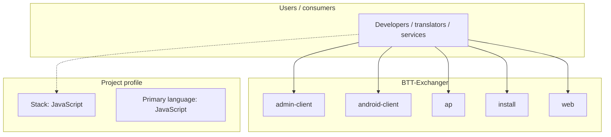
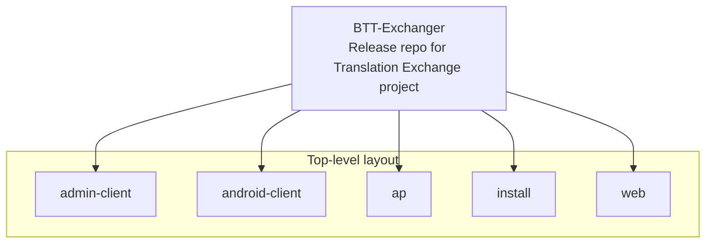

# BTT-Exchanger architecture

[Bible-Translation-Tools/BTT-Exchanger](https://github.com/Bible-Translation-Tools/BTT-Exchanger) — Release repo for Translation Exchange project.

BTT Exchanger is a platform for backup, checking, collating, and exporting oral bible translation

## System context

## Repository structure

**Directories:** `admin-client`, `android-client`, `ap`, `install`, `web`

**Notable files:** `.gitignore`, `build.sh`, `crowdin.yml`, `LICENSE`, `README.md`, `release.sh`

## Runtime / integration sketch

> This diagram is inferred from repository layout, languages, and README. It is a starting map, not a full design review.

## Languages

| Language | Approx. file count |
|----------|-------------------|
| JavaScript | 351 files |
| Python | 99 files |
| XML | 33 files |
| Shell | 25 files |
| CSS | 18 files |
| YAML | 13 files |
| Java | 9 files |
| Gradle | 6 files |

## Design notes

| Topic | Detail |
|--------|--------|
| **Stack** | JavaScript |
| **Default branch** | `dev` |
| **Org** | Bible-Translation-Tools |

## Related

- Source: [Bible-Translation-Tools/BTT-Exchanger](https://github.com/Bible-Translation-Tools/BTT-Exchanger)
- Branch analyzed: `dev`
