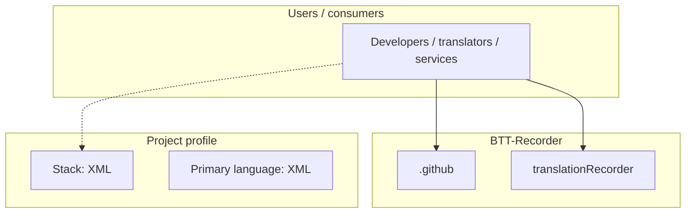
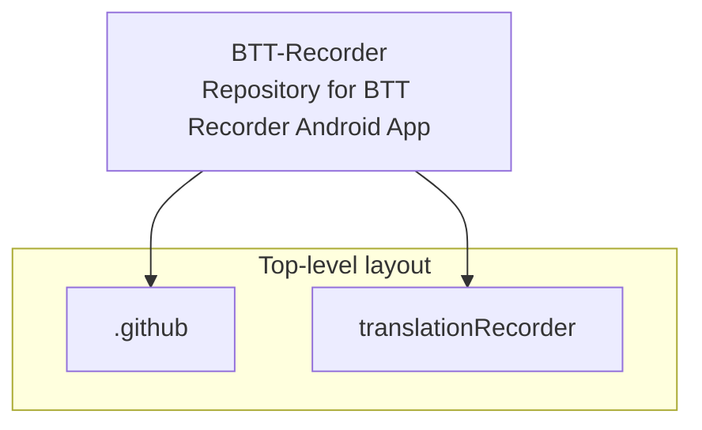
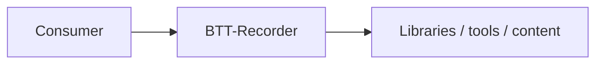

# BTT-Recorder architecture

[Bible-Translation-Tools/BTT-Recorder](https://github.com/Bible-Translation-Tools/BTT-Recorder) — Repository for BTT Recorder Android App.

Designed to give mother-tongue oral-only translators a tool for recording scripture audio content, translationRecorder focuses on a simple user interface and high quality recording.

## System context

## Repository structure

**Directories:** `.github`, `translationRecorder`

**Notable files:** `.gitignore`, `crowdin.yml`, `LICENSE`, `README.md`

## Runtime / integration sketch

> This diagram is inferred from repository layout, languages, and README. It is a starting map, not a full design review.

## Languages

| Language | Approx. file count |
|----------|-------------------|
| XML | 232 files |
| Kotlin | 166 files |
| Java | 105 files |
| Gradle | 14 files |
| JavaScript | 11 files |
| Python | 6 files |
| CSS | 4 files |
| YAML | 1 files |

## Design notes

| Topic | Detail |
|--------|--------|
| **Stack** | XML |
| **Default branch** | `master` |
| **Org** | Bible-Translation-Tools |

## Related

- Source: [Bible-Translation-Tools/BTT-Recorder](https://github.com/Bible-Translation-Tools/BTT-Recorder)
- Branch analyzed: `master`
