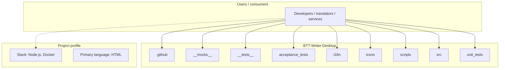
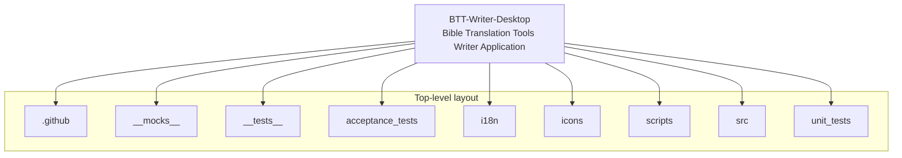
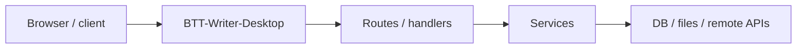

# BTT-Writer-Desktop architecture

[Bible-Translation-Tools/BTT-Writer-Desktop](https://github.com/Bible-Translation-Tools/BTT-Writer-Desktop) — Bible Translation Tools Writer Application.

BTT-Writer Desktop --

## System context

## Repository structure

**Directories:** `.github`, `__mocks__`, `__tests__`, `acceptance_tests`, `i18n`, `icons`, `scripts`, `src`, `unit_tests`

**Notable files:** `.bowerrc`, `.dockerignore`, `.editorconfig`, `.gitattributes`, `.gitignore`, `.jscsrc`, `.jshintrc`, `bower.json`, `CHANGELOG.md`, `config.json.enc`, `crowdin.yml`, `Dockerfile`, `dropbox_uploader.sh`, `gogs-client-lib-request.diff`, `gulpfile.js`, `LICENSE`, `makefile`, `package.json`, `pioneer.json`, `private.json.gpg`

## Runtime / integration sketch

> This diagram is inferred from repository layout, languages, and README. It is a starting map, not a full design review.

## Languages

| Language | Approx. file count |
|----------|-------------------|
| HTML | 80 files |
| JavaScript | 69 files |
| Shell | 5 files |
| CSS | 5 files |
| YAML | 1 files |
| SQL | 1 files |

## Design notes

| Topic | Detail |
|--------|--------|
| **Stack** | Node.js, Docker |
| **Default branch** | `master` |
| **Org** | Bible-Translation-Tools |

## Related

- Source: [Bible-Translation-Tools/BTT-Writer-Desktop](https://github.com/Bible-Translation-Tools/BTT-Writer-Desktop)
- Branch analyzed: `master`
