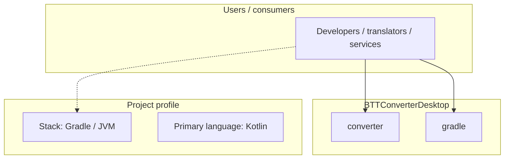
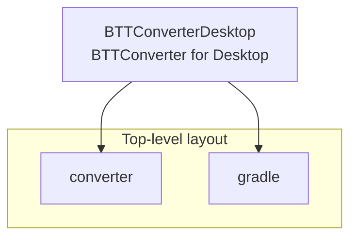
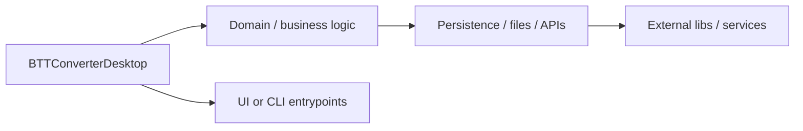

# BTTConverterDesktop architecture

[Bible-Translation-Tools/BTTConverterDesktop](https://github.com/Bible-Translation-Tools/BTTConverterDesktop) — BTTConverter for Desktop.

BTTConverter for Desktop

## System context

## Repository structure

**Directories:** `converter`, `gradle`

**Notable files:** `.gitignore`, `.travis.yml`, `build.gradle`, `crowdin.yml`, `gradlew`, `gradlew.bat`, `jar2appvars.env`, `LICENSE`, `README.md`, `settings.gradle`

## Runtime / integration sketch

> This diagram is inferred from repository layout, languages, and README. It is a starting map, not a full design review.

## Languages

| Language | Approx. file count |
|----------|-------------------|
| Kotlin | 26 files |
| CSS | 8 files |
| Gradle | 3 files |
| YAML | 1 files |
| Batch | 1 files |

## Design notes

| Topic | Detail |
|--------|--------|
| **Stack** | Gradle / JVM |
| **Default branch** | `master` |
| **Org** | Bible-Translation-Tools |

## Related

- Source: [Bible-Translation-Tools/BTTConverterDesktop](https://github.com/Bible-Translation-Tools/BTTConverterDesktop)
- Branch analyzed: `master`
