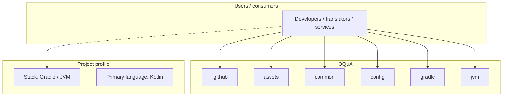
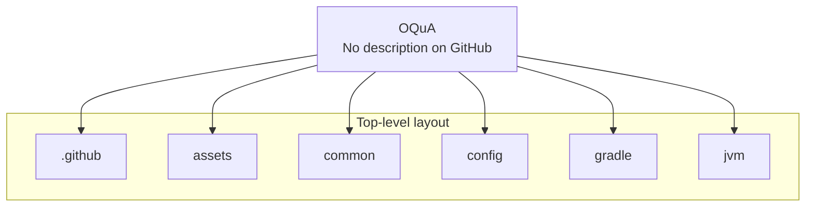
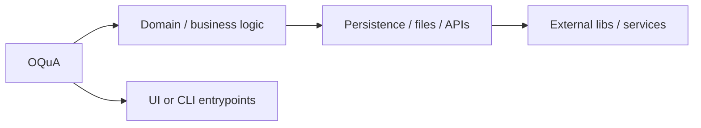

# OQuA architecture

[Bible-Translation-Tools/OQuA](https://github.com/Bible-Translation-Tools/OQuA) — _no GitHub description_.

Orature is an application for oral drafting, narration, and translation of the Bible, books (such as [Open Bible Stories](https://www.unfoldingword.org/open-bible-stories)), and translation helps/resources (such as notes and checking questions). Additionally, Orature can connect with third party applications for more expansive recording and editing options. More information can be found [here.](https://bibletranslationtools.org/tool/orature/), as well as in the [wiki.](https://github.com/Bible-Translation-Tools/Orature/wiki)

## System context

## Repository structure

**Directories:** `.github`, `assets`, `common`, `config`, `gradle`, `jvm`

**Notable files:** `.gitattributes`, `.gitignore`, `.sonarcloud.properties`, `build.gradle`, `COPYING`, `crowdin.yml`, `dependencies.gradle`, `dev-build.sh`, `gradle.properties`, `gradlew`, `gradlew.bat`, `LICENSE`, `README.md`, `settings.gradle`, `signing.p12.gpg`, `sonar-project.properties`, `VERSION`

## Runtime / integration sketch

> This diagram is inferred from repository layout, languages, and README. It is a starting map, not a full design review.

## Languages

| Language | Approx. file count |
|----------|-------------------|
| Kotlin | 558 files |
| CSS | 54 files |
| Gradle | 15 files |
| YAML | 13 files |
| SQL | 2 files |
| Shell | 1 files |
| Batch | 1 files |
| Java | 1 files |

## Design notes

| Topic | Detail |
|--------|--------|
| **Stack** | Gradle / JVM |
| **Default branch** | `dev` |
| **Org** | Bible-Translation-Tools |

## Related

- Source: [Bible-Translation-Tools/OQuA](https://github.com/Bible-Translation-Tools/OQuA)
- Branch analyzed: `dev`
