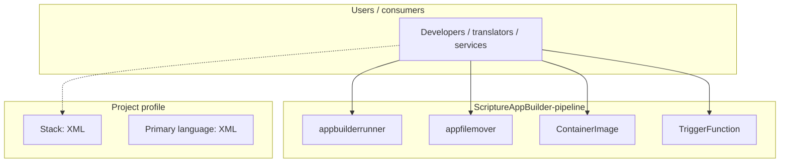
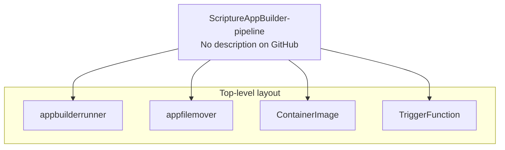

# ScriptureAppBuilder-pipeline architecture

[Bible-Translation-Tools/ScriptureAppBuilder-pipeline](https://github.com/Bible-Translation-Tools/ScriptureAppBuilder-pipeline) — _no GitHub description_.

ScriptureAppBuilder-pipeline is a public repository under Bible-Translation-Tools.

## System context

## Repository structure

**Directories:** `appbuilderrunner`, `appfilemover`, `ContainerImage`, `TriggerFunction`

**Notable files:** `README.md`

## Runtime / integration sketch

> This diagram is inferred from repository layout, languages, and README. It is a starting map, not a full design review.

## Languages

| Language | Approx. file count |
|----------|-------------------|
| XML | 1 files |
| Shell | 1 files |
| JavaScript | 1 files |
| PowerShell | 1 files |

## Design notes

| Topic | Detail |
|--------|--------|
| **Stack** | XML |
| **Default branch** | `base` |
| **Org** | Bible-Translation-Tools |

## Related

- Source: [Bible-Translation-Tools/ScriptureAppBuilder-pipeline](https://github.com/Bible-Translation-Tools/ScriptureAppBuilder-pipeline)
- Branch analyzed: `base`
