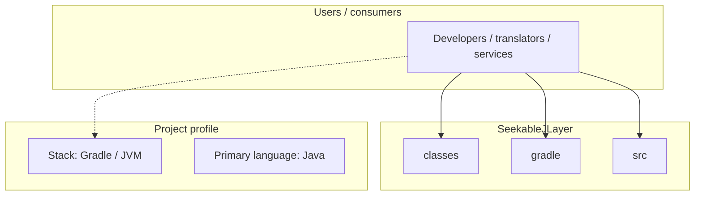
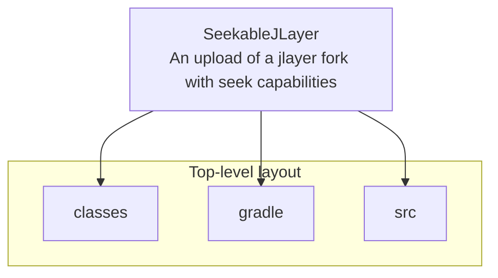
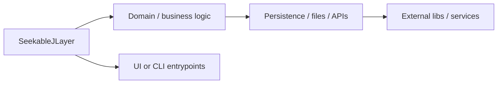

# SeekableJLayer architecture

[Bible-Translation-Tools/SeekableJLayer](https://github.com/Bible-Translation-Tools/SeekableJLayer) — An upload of a jlayer fork with seek capabilities.

An upload of a jlayer fork with seek capabilities

## System context

## Repository structure

**Directories:** `classes`, `gradle`, `src`

**Notable files:** `.classpath`, `.gitignore`, `build.gradle`, `CHANGES.txt`, `gradlew`, `gradlew.bat`, `LICENSE.txt`, `README.txt`, `settings.gradle`

## Runtime / integration sketch

> This diagram is inferred from repository layout, languages, and README. It is a starting map, not a full design review.

## Languages

| Language | Approx. file count |
|----------|-------------------|
| Java | 23 files |
| Gradle | 2 files |
| Kotlin | 2 files |
| Batch | 1 files |

## Design notes

| Topic | Detail |
|--------|--------|
| **Stack** | Gradle / JVM |
| **Default branch** | `master` |
| **Org** | Bible-Translation-Tools |

## Related

- Source: [Bible-Translation-Tools/SeekableJLayer](https://github.com/Bible-Translation-Tools/SeekableJLayer)
- Branch analyzed: `master`
