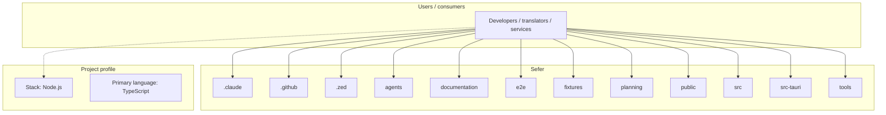
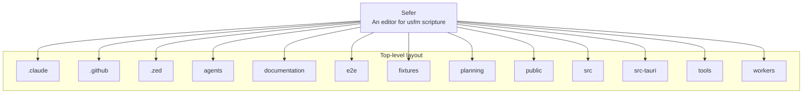
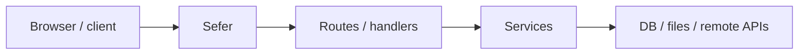

# Sefer architecture

[Bible-Translation-Tools/Sefer](https://github.com/Bible-Translation-Tools/Sefer) — An editor for usfm scripture.

Sefer is a local-first scripture editor. Its editing authority is one canonical UTF-8 Source per Book; parser products, diagnostics, and rendered views are derived from that Source.

## System context

## Repository structure

**Directories:** `.claude`, `.github`, `.zed`, `agents`, `documentation`, `e2e`, `fixtures`, `planning`, `public`, `src`, `src-tauri`, `tools`, `workers`

**Notable files:** `.fallowrc.jsonc`, `.gitignore`, `.oxfmtrc.json`, `AGENTS.md`, `CLAUDE.MD`, `lefthook.yml`, `oxlint.config.ts`, `oxlint.release.config.ts`, `package.json`, `pnpm-lock.yaml`, `pnpm-workspace.yaml`, `README.md`, `tsconfig.json`, `vite.config.ts`, `wrangler.jsonc`

## Runtime / integration sketch

> This diagram is inferred from repository layout, languages, and README. It is a starting map, not a full design review.

## Languages

| Language | Approx. file count |
|----------|-------------------|
| TypeScript | 357 files |
| Rust | 7 files |
| YAML | 4 files |
| CSS | 3 files |

## Design notes

| Topic | Detail |
|--------|--------|
| **Stack** | Node.js |
| **Default branch** | `master` |
| **Org** | Bible-Translation-Tools |

## Related

- Source: [Bible-Translation-Tools/Sefer](https://github.com/Bible-Translation-Tools/Sefer)
- Branch analyzed: `master`
