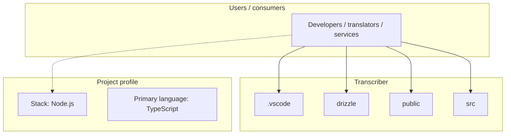
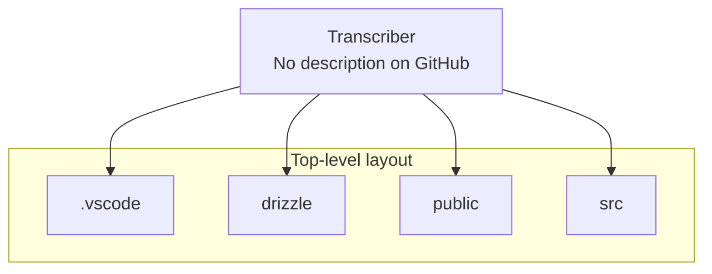
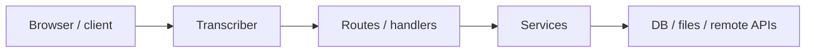

# Transcriber architecture

[Bible-Translation-Tools/Transcriber](https://github.com/Bible-Translation-Tools/Transcriber) — _no GitHub description_.

This template provides a minimal setup to get React working in Vite with HMR and some ESLint rules.

## System context

## Repository structure

**Directories:** `.vscode`, `drizzle`, `public`, `src`

**Notable files:** `.gitignore`, `biome.jsonc`, `crowdin.yml`, `drizzle.config.ts`, `index.html`, `lefthook.yml`, `LICENSE`, `package.json`, `pnpm-lock.yaml`, `pnpm-workspace.yaml`, `README.md`, `tsconfig.app.json`, `tsconfig.json`, `tsconfig.node.json`, `tsconfig.worker.json`, `vite.config.ts`, `worker-configuration.d.ts`, `wrangler.jsonc`

## Runtime / integration sketch

> This diagram is inferred from repository layout, languages, and README. It is a starting map, not a full design review.

## Languages

| Language | Approx. file count |
|----------|-------------------|
| TypeScript | 84 files |
| YAML | 4 files |
| SQL | 3 files |
| CSS | 3 files |
| HTML | 1 files |
| JavaScript | 1 files |

## Design notes

| Topic | Detail |
|--------|--------|
| **Stack** | Node.js |
| **Default branch** | `default` |
| **Org** | Bible-Translation-Tools |

## Related

- Source: [Bible-Translation-Tools/Transcriber](https://github.com/Bible-Translation-Tools/Transcriber)
- Branch analyzed: `default`
