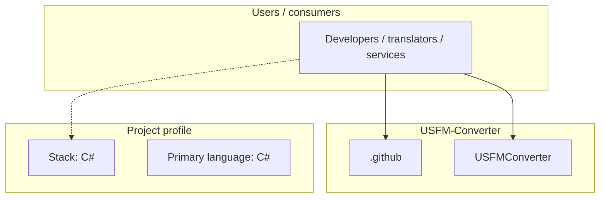
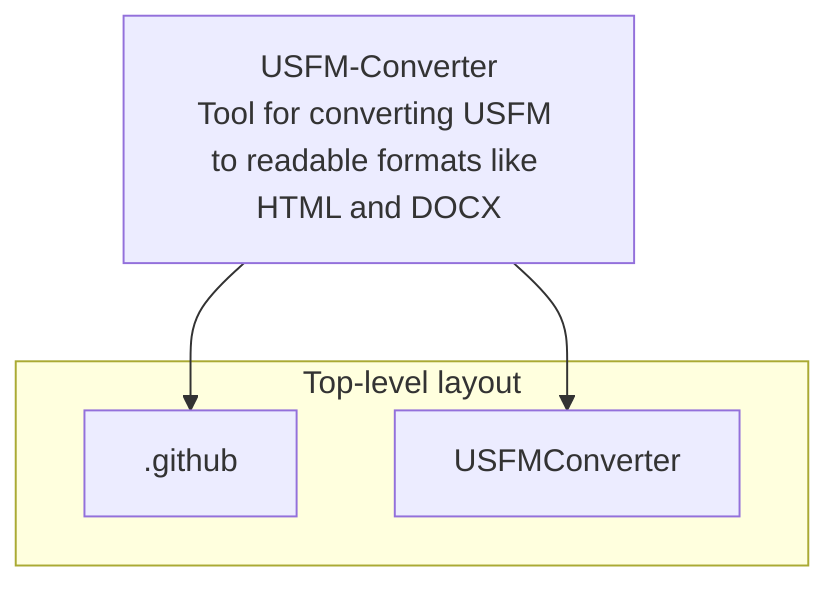

# USFM-Converter architecture

[Bible-Translation-Tools/USFM-Converter](https://github.com/Bible-Translation-Tools/USFM-Converter) — Tool for converting USFM to readable formats like HTML and DOCX.

Tool for converting USFM to readable formats like HTML and DOCX.

## System context

## Repository structure

**Directories:** `.github`, `USFMConverter`

**Notable files:** `.gitignore`, `CHANGELOG.md`, `installerscript.iss`, `README.md`, `usfm-dmg-bg.png`, `usfmconverter.desktop`, `usfmconverter.entitlements`, `usfmconverter.icns`, `usfmconverter.install4j`, `usfmicon.png`

## Runtime / integration sketch

> This diagram is inferred from repository layout, languages, and README. It is a starting map, not a full design review.

## Languages

| Language | Approx. file count |
|----------|-------------------|
| C# | 33 files |
| CSS | 1 files |

## Design notes

| Topic | Detail |
|--------|--------|
| **Stack** | C# |
| **Default branch** | `release` |
| **Org** | Bible-Translation-Tools |

## Related

- Source: [Bible-Translation-Tools/USFM-Converter](https://github.com/Bible-Translation-Tools/USFM-Converter)
- Branch analyzed: `release`
