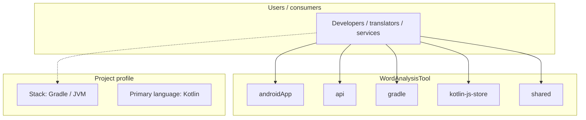
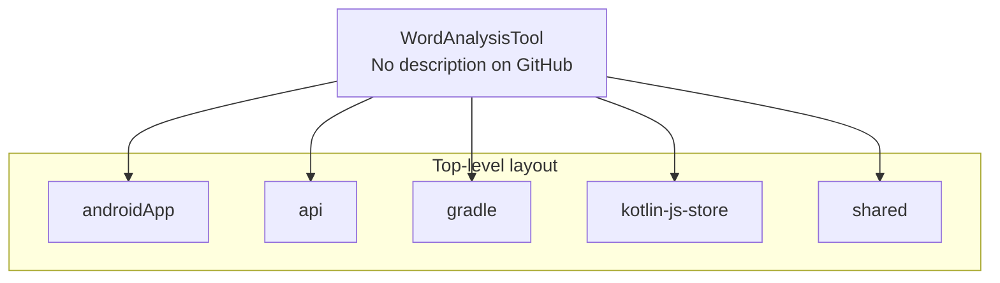
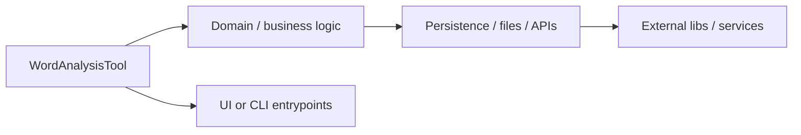

# WordAnalysisTool architecture

[Bible-Translation-Tools/WordAnalysisTool](https://github.com/Bible-Translation-Tools/WordAnalysisTool) — _no GitHub description_.

This is WordAnalysisTool targeting Android, Web, Desktop.

## System context

## Repository structure

**Directories:** `androidApp`, `api`, `gradle`, `kotlin-js-store`, `shared`

**Notable files:** `.gitignore`, `build.gradle.kts`, `gradle.properties`, `gradlew`, `gradlew.bat`, `README.md`, `settings.gradle.kts`

## Runtime / integration sketch

> This diagram is inferred from repository layout, languages, and README. It is a starting map, not a full design review.

## Languages

| Language | Approx. file count |
|----------|-------------------|
| Kotlin | 117 files |
| XML | 11 files |
| TypeScript | 10 files |
| SQL | 5 files |
| Batch | 1 files |
| HTML | 1 files |
| CSS | 1 files |

## Design notes

| Topic | Detail |
|--------|--------|
| **Stack** | Gradle / JVM |
| **Default branch** | `master` |
| **Org** | Bible-Translation-Tools |

## Related

- Source: [Bible-Translation-Tools/WordAnalysisTool](https://github.com/Bible-Translation-Tools/WordAnalysisTool)
- Branch analyzed: `master`
