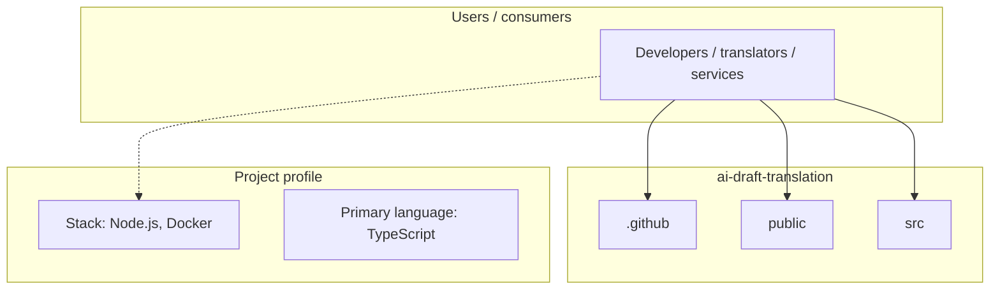
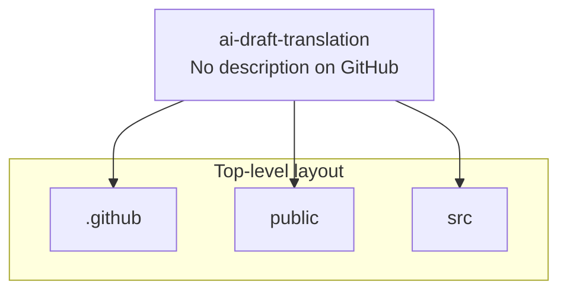
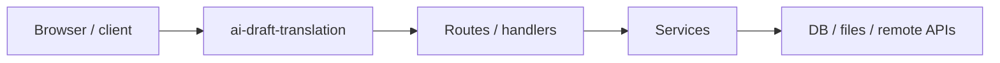

# ai-draft-translation architecture

[Bible-Translation-Tools/ai-draft-translation](https://github.com/Bible-Translation-Tools/ai-draft-translation) — _no GitHub description_.

A React web application that provides translation services using the NLLB (No Language Left Behind) model. The app mimics Google Translate functionality with a modern, responsive interface.

## System context

## Repository structure

**Directories:** `.github`, `public`, `src`

**Notable files:** `.eslintrc.cjs`, `.gitignore`, `docker-compose.yaml`, `Dockerfile`, `index.html`, `nginx.conf`, `package.json`, `pnpm-lock.yaml`, `pnpm-workspace.yaml`, `PUSH_NOTIFICATIONS_SETUP.md`, `README.md`, `task.md`, `tsconfig.json`, `tsconfig.node.json`, `vite.config.ts`

## Runtime / integration sketch

> This diagram is inferred from repository layout, languages, and README. It is a starting map, not a full design review.

## Languages

| Language | Approx. file count |
|----------|-------------------|
| TypeScript | 23 files |
| YAML | 3 files |
| HTML | 1 files |
| JavaScript | 1 files |
| CSS | 1 files |

## Design notes

| Topic | Detail |
|--------|--------|
| **Stack** | Node.js, Docker |
| **Default branch** | `master` |
| **Org** | Bible-Translation-Tools |

## Related

- Source: [Bible-Translation-Tools/ai-draft-translation](https://github.com/Bible-Translation-Tools/ai-draft-translation)
- Branch analyzed: `master`
