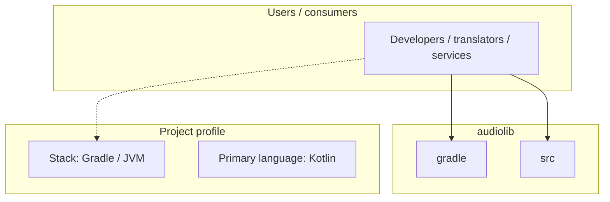
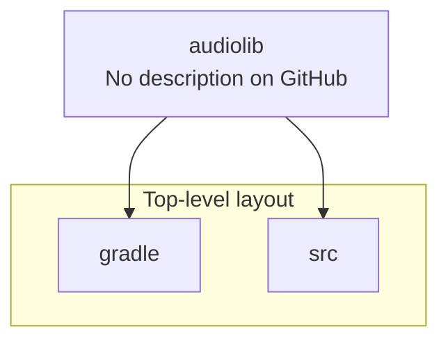

# audiolib architecture

[Bible-Translation-Tools/audiolib](https://github.com/Bible-Translation-Tools/audiolib) — _no GitHub description_.

audiolib is a public repository under Bible-Translation-Tools.

## System context

## Repository structure

**Directories:** `gradle`, `src`

**Notable files:** `.gitignore`, `build.gradle`, `gradle.properties`, `gradlew`, `gradlew.bat`, `LICENSE`, `README.md`, `settings.gradle`

## Runtime / integration sketch

```mermaid
flowchart LR
  App["audiolib"] --> Domain["Domain / business logic"]
  Domain --> Data["Persistence / files / APIs"]
  App --> UI["UI or CLI entrypoints"]
  Data --> Ext["External libs / services"]
```

> This diagram is inferred from repository layout, languages, and README. It is a starting map, not a full design review.

## Languages

| Language | Approx. file count |
|----------|-------------------|
| Kotlin | 10 files |
| Gradle | 2 files |
| Batch | 1 files |

## Design notes

| Topic | Detail |
|--------|--------|
| **Stack** | Gradle / JVM |
| **Default branch** | `master` |
| **Org** | Bible-Translation-Tools |

## Related

- Source: [Bible-Translation-Tools/audiolib](https://github.com/Bible-Translation-Tools/audiolib)
- Branch analyzed: `master`
