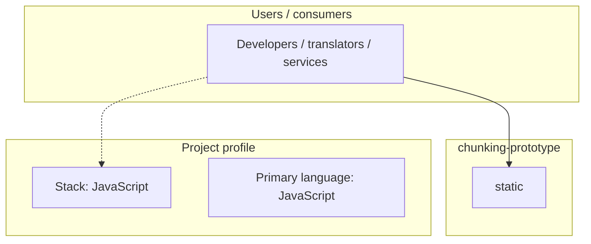
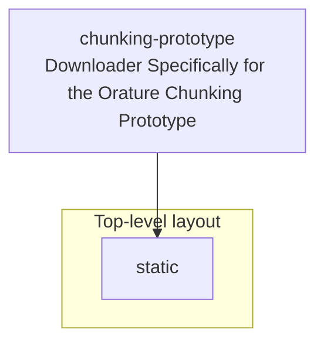

# chunking-prototype architecture

[Bible-Translation-Tools/chunking-prototype](https://github.com/Bible-Translation-Tools/chunking-prototype) — Downloader Specifically for the Orature Chunking Prototype.

Downloader Specifically for the Orature Chunking Prototype

## System context

## Repository structure

**Directories:** `static`

**Notable files:** `.gitignore`, `asset-manifest.json`, `favicon.ico`, `index.html`, `logo192.png`, `logo512.png`, `manifest.json`, `robots.txt`

## Runtime / integration sketch

> This diagram is inferred from repository layout, languages, and README. It is a starting map, not a full design review.

## Languages

| Language | Approx. file count |
|----------|-------------------|
| JavaScript | 4 files |
| HTML | 1 files |
| CSS | 1 files |

## Design notes

| Topic | Detail |
|--------|--------|
| **Stack** | JavaScript |
| **Default branch** | `default` |
| **Org** | Bible-Translation-Tools |

## Related

- Source: [Bible-Translation-Tools/chunking-prototype](https://github.com/Bible-Translation-Tools/chunking-prototype)
- Branch analyzed: `default`
