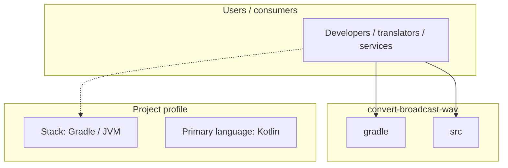
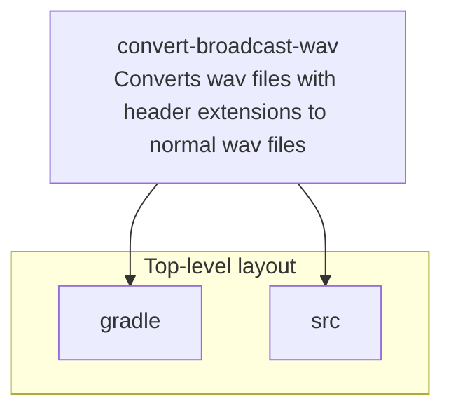
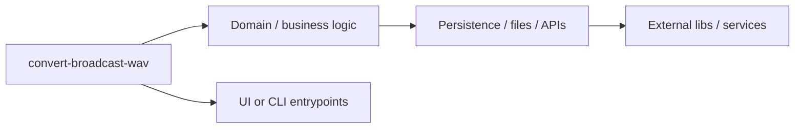

# convert-broadcast-wav architecture

[Bible-Translation-Tools/convert-broadcast-wav](https://github.com/Bible-Translation-Tools/convert-broadcast-wav) — Converts wav files with header extensions to normal wav files.

Converts a wav file or directory, placing the results in a directory titled "broadcast_wav_converted"

## System context

## Repository structure

**Directories:** `gradle`, `src`

**Notable files:** `.gitignore`, `build.gradle.kts`, `gradle.properties`, `gradlew`, `gradlew.bat`, `LICENSE`, `README`, `settings.gradle.kts`

## Runtime / integration sketch

> This diagram is inferred from repository layout, languages, and README. It is a starting map, not a full design review.

## Languages

| Language | Approx. file count |
|----------|-------------------|
| Kotlin | 3 files |
| Batch | 1 files |

## Design notes

| Topic | Detail |
|--------|--------|
| **Stack** | Gradle / JVM |
| **Default branch** | `default` |
| **Org** | Bible-Translation-Tools |

## Related

- Source: [Bible-Translation-Tools/convert-broadcast-wav](https://github.com/Bible-Translation-Tools/convert-broadcast-wav)
- Branch analyzed: `default`
