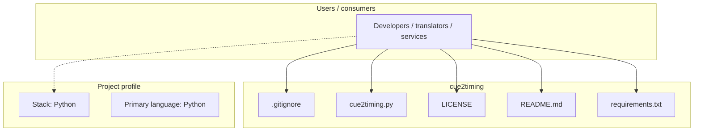
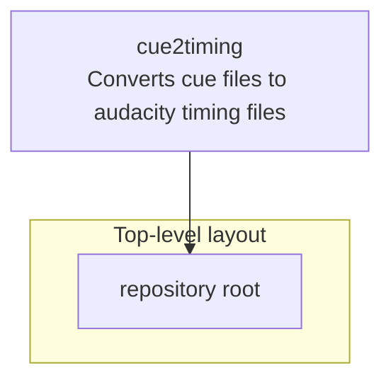
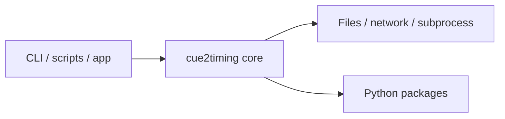

# cue2timing architecture

[Bible-Translation-Tools/cue2timing](https://github.com/Bible-Translation-Tools/cue2timing) — Converts cue files to audacity timing files.

Converts cue files to audacity timing files

## System context

## Repository structure

**Notable files:** `.gitignore`, `cue2timing.py`, `LICENSE`, `README.md`, `requirements.txt`

## Runtime / integration sketch

> This diagram is inferred from repository layout, languages, and README. It is a starting map, not a full design review.

## Languages

| Language | Approx. file count |
|----------|-------------------|
| Python | 1 files |

## Design notes

| Topic | Detail |
|--------|--------|
| **Stack** | Python |
| **Default branch** | `default` |
| **Org** | Bible-Translation-Tools |

## Related

- Source: [Bible-Translation-Tools/cue2timing](https://github.com/Bible-Translation-Tools/cue2timing)
- Branch analyzed: `default`
