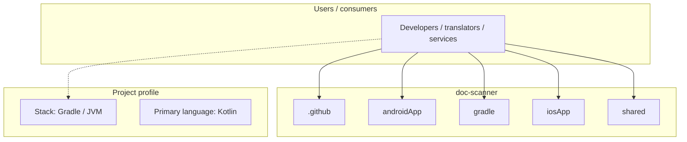
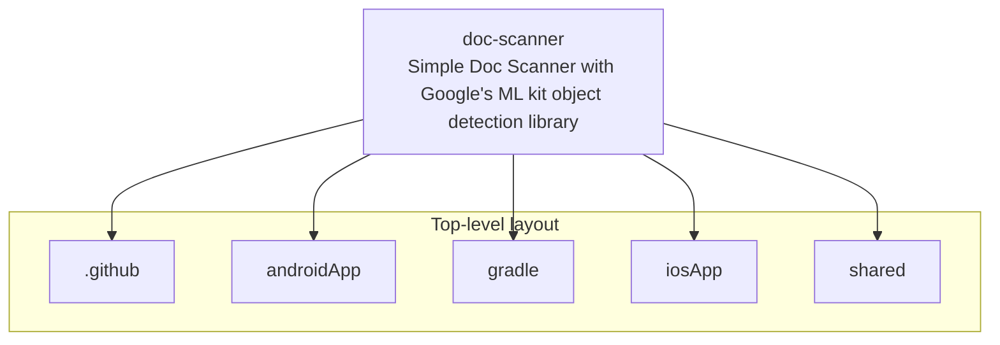
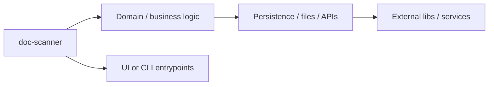

# doc-scanner architecture

[Bible-Translation-Tools/doc-scanner](https://github.com/Bible-Translation-Tools/doc-scanner) — Simple Doc Scanner with Google's ML kit object detection library.

DocScanner is a native **Kotlin Multiplatform (KMP)** application targeting Android and iOS. It is designed to capture physical handwritten documents, manage translation projects, render pages to images, and send them to a Cloudflare Workers backend for **Handwritten Text Recognition (HTR)** transcription using state-of-the-art AI models.

## System context

## Repository structure

**Directories:** `.github`, `androidApp`, `gradle`, `iosApp`, `shared`

**Notable files:** `.gitignore`, `build.gradle.kts`, `gradle.properties`, `gradlew`, `gradlew.bat`, `play_store_feature_graphic.png`, `play_store_icon.png`, `README.md`, `settings.gradle.kts`

## Runtime / integration sketch

> This diagram is inferred from repository layout, languages, and README. It is a starting map, not a full design review.

## Languages

| Language | Approx. file count |
|----------|-------------------|
| Kotlin | 70 files |
| XML | 11 files |
| Swift | 2 files |
| Batch | 1 files |

## Design notes

| Topic | Detail |
|--------|--------|
| **Stack** | Gradle / JVM |
| **Default branch** | `main` |
| **Org** | Bible-Translation-Tools |

## Related

- Source: [Bible-Translation-Tools/doc-scanner](https://github.com/Bible-Translation-Tools/doc-scanner)
- Branch analyzed: `main`
