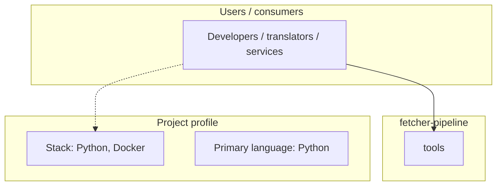
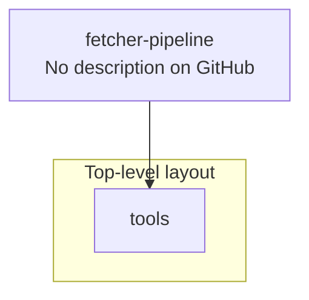
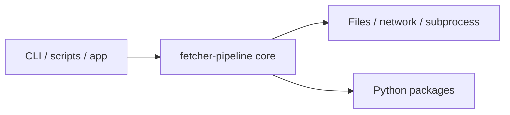

# fetcher-pipeline architecture

[Bible-Translation-Tools/fetcher-pipeline](https://github.com/Bible-Translation-Tools/fetcher-pipeline) — _no GitHub description_.

Python 3.8

## System context

## Repository structure

**Directories:** `tools`

**Notable files:** `.gitignore`, `app.py`, `chapter_worker.py`, `Dockerfile`, `entrypoint.sh`, `file_utils.py`, `LICENSE`, `process_tools.py`, `README.md`, `requirements.txt`, `tr_worker.py`, `verse_worker.py`, `worker.sh`

## Runtime / integration sketch

> This diagram is inferred from repository layout, languages, and README. It is a starting map, not a full design review.

## Languages

| Language | Approx. file count |
|----------|-------------------|
| Python | 6 files |
| Shell | 2 files |

## Design notes

| Topic | Detail |
|--------|--------|
| **Stack** | Python, Docker |
| **Default branch** | `master` |
| **Org** | Bible-Translation-Tools |

## Related

- Source: [Bible-Translation-Tools/fetcher-pipeline](https://github.com/Bible-Translation-Tools/fetcher-pipeline)
- Branch analyzed: `master`
