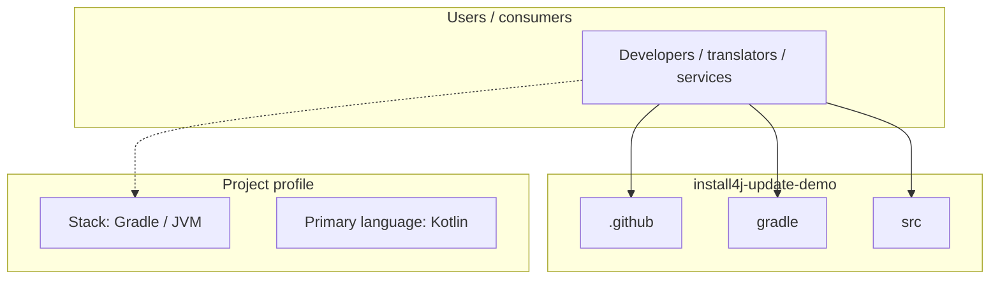
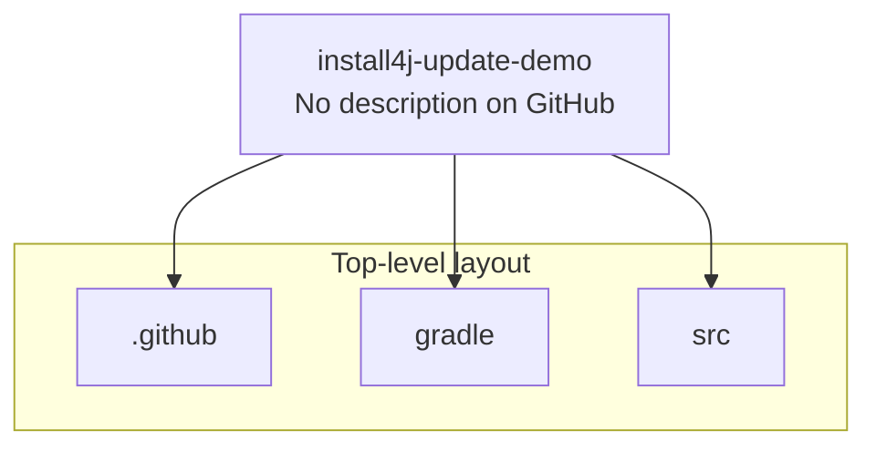
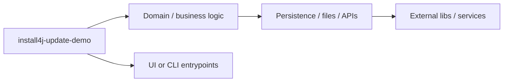

# install4j-update-demo architecture

[Bible-Translation-Tools/install4j-update-demo](https://github.com/Bible-Translation-Tools/install4j-update-demo) — _no GitHub description_.

A simple, preconfigured gradle project to use as a starting point for new javafx projects

## System context

## Repository structure

**Directories:** `.github`, `gradle`, `src`

**Notable files:** `.gitattributes`, `.gitignore`, `build.gradle`, `dependencies.gradle`, `gradlew`, `gradlew.bat`, `README.md`, `settings.gradle`, `updater.install4j`

## Runtime / integration sketch

> This diagram is inferred from repository layout, languages, and README. It is a starting map, not a full design review.

## Languages

| Language | Approx. file count |
|----------|-------------------|
| Kotlin | 12 files |
| Gradle | 3 files |
| Batch | 1 files |
| CSS | 1 files |

## Design notes

| Topic | Detail |
|--------|--------|
| **Stack** | Gradle / JVM |
| **Default branch** | `default` |
| **Org** | Bible-Translation-Tools |

## Related

- Source: [Bible-Translation-Tools/install4j-update-demo](https://github.com/Bible-Translation-Tools/install4j-update-demo)
- Branch analyzed: `default`
