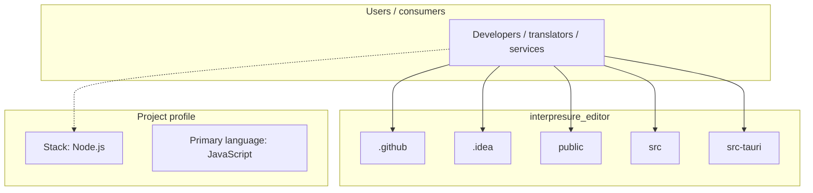
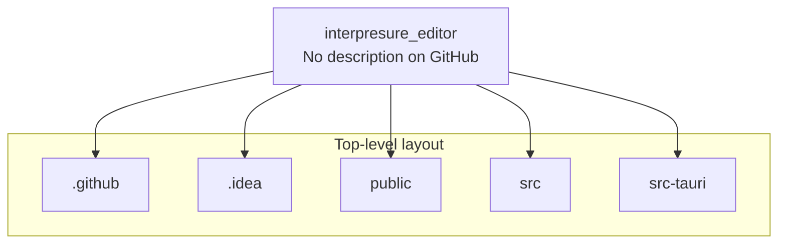

# interpresure_editor architecture

[Bible-Translation-Tools/interpresure_editor](https://github.com/Bible-Translation-Tools/interpresure_editor) — _no GitHub description_.

This template provides a minimal setup to get React working in Vite with HMR and some ESLint rules.

## System context

## Repository structure

**Directories:** `.github`, `.idea`, `public`, `src`, `src-tauri`

**Notable files:** `.gitattributes`, `.gitignore`, `eslint.config.js`, `index.html`, `LICENSE`, `package-lock.json`, `package.json`, `pnpm-lock.yaml`, `README.md`, `vite.config.js`

## Runtime / integration sketch

> This diagram is inferred from repository layout, languages, and README. It is a starting map, not a full design review.

## Languages

| Language | Approx. file count |
|----------|-------------------|
| JavaScript | 4 files |
| Rust | 3 files |
| CSS | 2 files |
| HTML | 1 files |
| YAML | 1 files |

## Design notes

| Topic | Detail |
|--------|--------|
| **Stack** | Node.js |
| **Default branch** | `main` |
| **Org** | Bible-Translation-Tools |

## Related

- Source: [Bible-Translation-Tools/interpresure_editor](https://github.com/Bible-Translation-Tools/interpresure_editor)
- Branch analyzed: `main`
