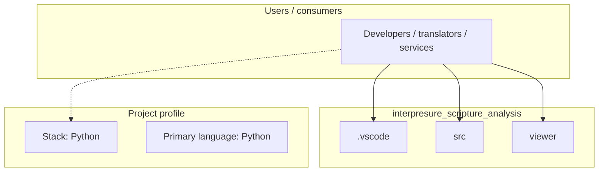
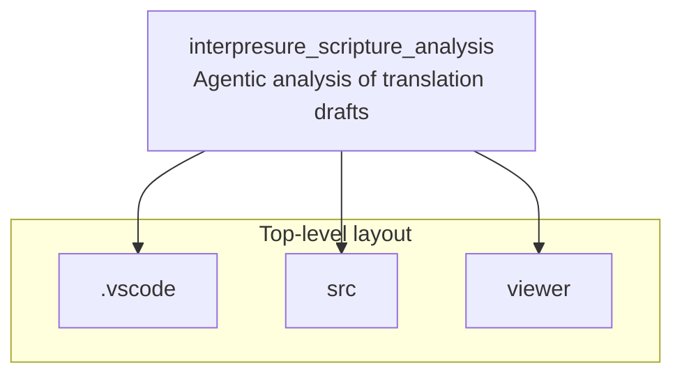

# interpresure_scripture_analysis architecture

[Bible-Translation-Tools/interpresure_scripture_analysis](https://github.com/Bible-Translation-Tools/interpresure_scripture_analysis) — Agentic analysis of translation drafts.

Agentic analysis of translation drafts

## System context

## Repository structure

**Directories:** `.vscode`, `src`, `viewer`

**Notable files:** `.gitattributes`, `.gitignore`, `LICENSE`, `README.md`

## Runtime / integration sketch

> This diagram is inferred from repository layout, languages, and README. It is a starting map, not a full design review.

## Languages

| Language | Approx. file count |
|----------|-------------------|
| Python | 17 files |
| JavaScript | 5 files |
| CSS | 2 files |
| HTML | 1 files |
| YAML | 1 files |
| TypeScript | 1 files |

## Design notes

| Topic | Detail |
|--------|--------|
| **Stack** | Python |
| **Default branch** | `main` |
| **Org** | Bible-Translation-Tools |

## Related

- Source: [Bible-Translation-Tools/interpresure_scripture_analysis](https://github.com/Bible-Translation-Tools/interpresure_scripture_analysis)
- Branch analyzed: `main`
