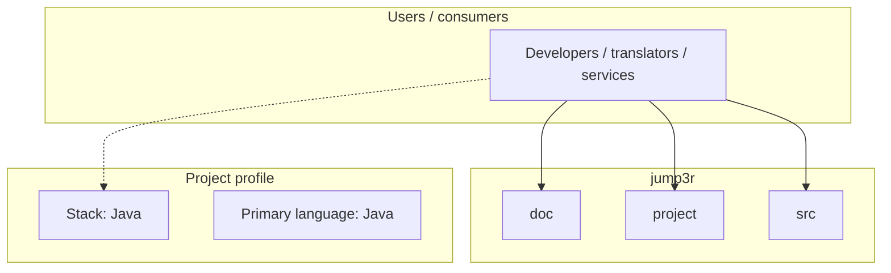
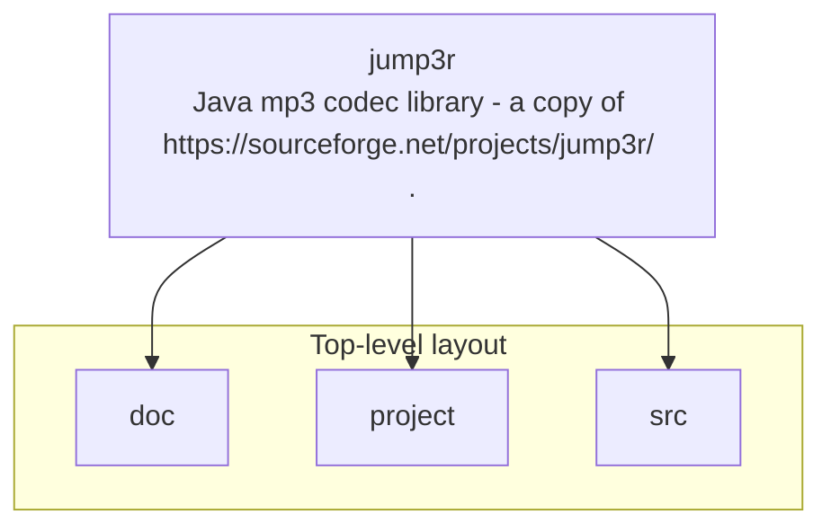

# jump3r architecture

[Bible-Translation-Tools/jump3r](https://github.com/Bible-Translation-Tools/jump3r) — Java mp3 codec library - a copy of https://sourceforge.net/projects/jump3r/ ..

A copy of an unofficial LAME mp3 library port to Java from https://sourceforge.net/projects/jump3r/

## System context

## Repository structure

**Directories:** `doc`, `project`, `src`

**Notable files:** `.gitignore`, `.travis.yml`, `build.sbt`, `LICENSE`, `README.md`, `sbt`

## Runtime / integration sketch

> This diagram is inferred from repository layout, languages, and README. It is a starting map, not a full design review.

## Languages

| Language | Approx. file count |
|----------|-------------------|
| Java | 74 files |

## Design notes

| Topic | Detail |
|--------|--------|
| **Stack** | Java |
| **Default branch** | `master` |
| **Org** | Bible-Translation-Tools |

## Related

- Source: [Bible-Translation-Tools/jump3r](https://github.com/Bible-Translation-Tools/jump3r)
- Branch analyzed: `master`
