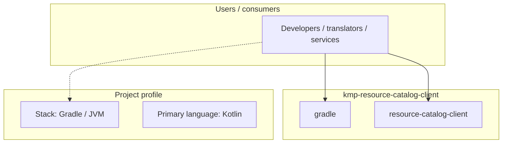
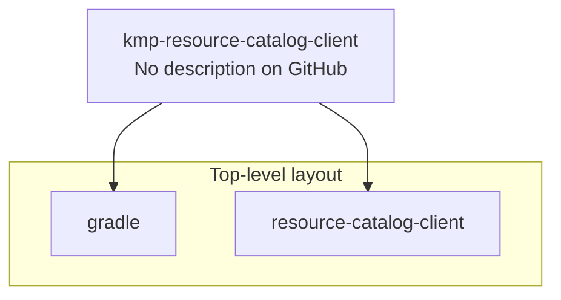
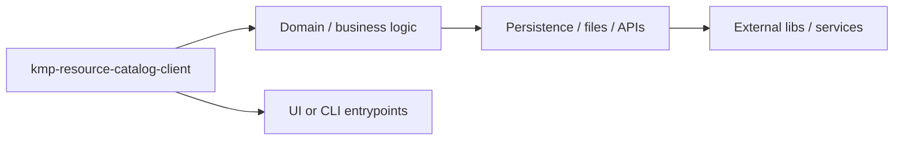

# kmp-resource-catalog-client architecture

[Bible-Translation-Tools/kmp-resource-catalog-client](https://github.com/Bible-Translation-Tools/kmp-resource-catalog-client) — _no GitHub description_.

A client library for interacting with the resource catalogs

## System context

## Repository structure

**Directories:** `gradle`, `resource-catalog-client`

**Notable files:** `.gitignore`, `build.gradle`, `DEPLOYING`, `gradle.properties`, `gradlew`, `gradlew.bat`, `LICENSE`, `README.md`, `settings.gradle`

## Runtime / integration sketch

> This diagram is inferred from repository layout, languages, and README. It is a starting map, not a full design review.

## Languages

| Language | Approx. file count |
|----------|-------------------|
| Kotlin | 27 files |
| Gradle | 3 files |
| XML | 2 files |
| Batch | 1 files |
| Java | 1 files |

## Design notes

| Topic | Detail |
|--------|--------|
| **Stack** | Gradle / JVM |
| **Default branch** | `default` |
| **Org** | Bible-Translation-Tools |

## Related

- Source: [Bible-Translation-Tools/kmp-resource-catalog-client](https://github.com/Bible-Translation-Tools/kmp-resource-catalog-client)
- Branch analyzed: `default`
