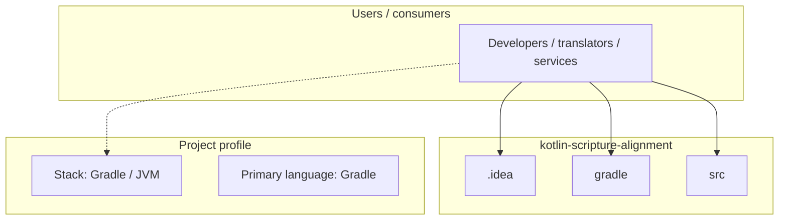
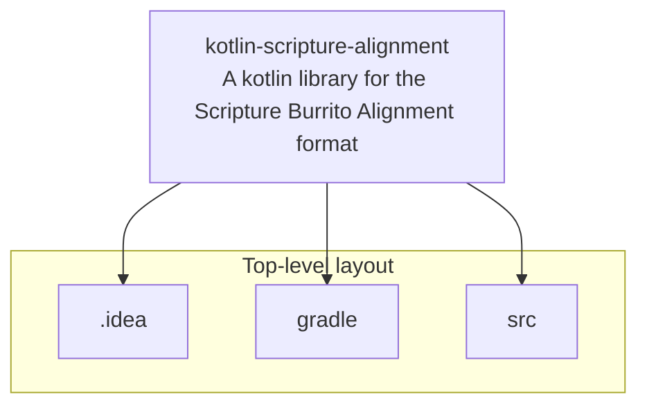
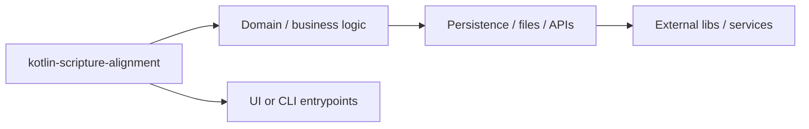

# kotlin-scripture-alignment architecture

[Bible-Translation-Tools/kotlin-scripture-alignment](https://github.com/Bible-Translation-Tools/kotlin-scripture-alignment) — A kotlin library for the Scripture Burrito Alignment format.

A kotlin library for the Scripture Burrito Alignment format

## System context

## Repository structure

**Directories:** `.idea`, `gradle`, `src`

**Notable files:** `.gitignore`, `build.gradle`, `gradle.properties`, `gradlew`, `gradlew.bat`, `LICENSE`, `settings.gradle`

## Runtime / integration sketch

> This diagram is inferred from repository layout, languages, and README. It is a starting map, not a full design review.

## Languages

| Language | Approx. file count |
|----------|-------------------|
| Gradle | 2 files |
| Kotlin | 2 files |
| Batch | 1 files |

## Design notes

| Topic | Detail |
|--------|--------|
| **Stack** | Gradle / JVM |
| **Default branch** | `main` |
| **Org** | Bible-Translation-Tools |

## Related

- Source: [Bible-Translation-Tools/kotlin-scripture-alignment](https://github.com/Bible-Translation-Tools/kotlin-scripture-alignment)
- Branch analyzed: `main`
