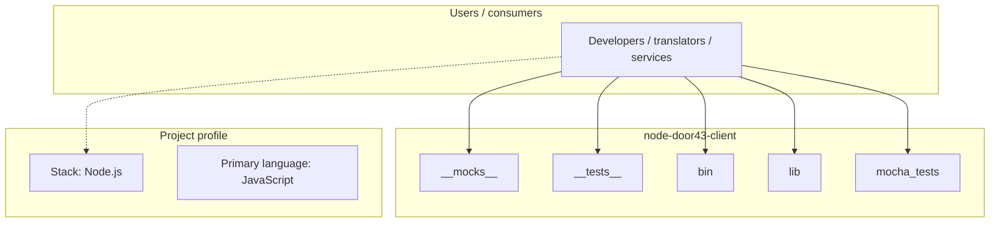
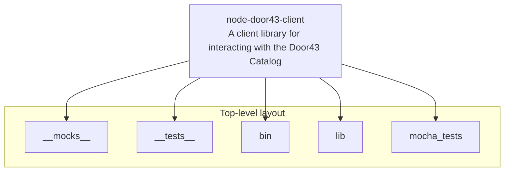
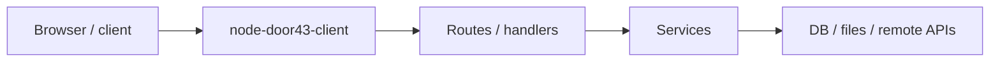

# node-door43-client architecture

[Bible-Translation-Tools/node-door43-client](https://github.com/Bible-Translation-Tools/node-door43-client) — A client library for interacting with the Door43 Catalog.

After cloning this fork, run: > npm install > npm pack

## System context

## Repository structure

**Directories:** `__mocks__`, `__tests__`, `bin`, `lib`, `mocha_tests`

**Notable files:** `.gitignore`, `.npmignore`, `client-cli.js`, `LICENSE`, `package-lock.json`, `package.json`, `README.md`

## Runtime / integration sketch

> This diagram is inferred from repository layout, languages, and README. It is a starting map, not a full design review.

## Languages

| Language | Approx. file count |
|----------|-------------------|
| JavaScript | 24 files |
| YAML | 4 files |

## Design notes

| Topic | Detail |
|--------|--------|
| **Stack** | Node.js |
| **Default branch** | `master` |
| **Org** | Bible-Translation-Tools |

## Related

- Source: [Bible-Translation-Tools/node-door43-client](https://github.com/Bible-Translation-Tools/node-door43-client)
- Branch analyzed: `master`
