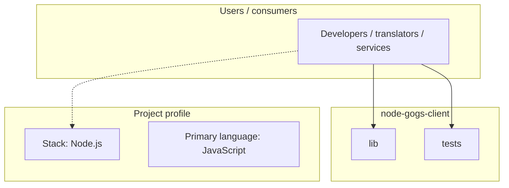
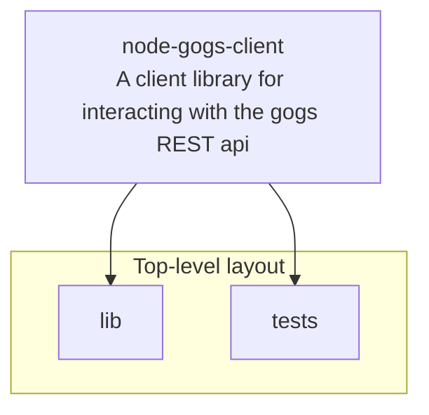
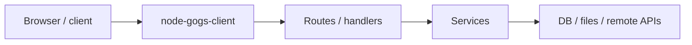

# node-gogs-client architecture

[Bible-Translation-Tools/node-gogs-client](https://github.com/Bible-Translation-Tools/node-gogs-client) — A client library for interacting with the gogs REST api.

A client library for interacting with the [Gogs](https://gogs.io) REST api. This library is written to communicate according to the api defined in [gogits/go-gogs-client](https://github.com/gogits/go-gogs-client/wiki).

## System context

## Repository structure

**Directories:** `lib`, `tests`

**Notable files:** `.gitignore`, `.npmignore`, `.travis.yml`, `config.json.enc`, `example.js`, `gulpfile.js`, `LICENSE`, `package-lock.json`, `package.json`, `README.md`

## Runtime / integration sketch

> This diagram is inferred from repository layout, languages, and README. It is a starting map, not a full design review.

## Languages

| Language | Approx. file count |
|----------|-------------------|
| JavaScript | 6 files |

## Design notes

| Topic | Detail |
|--------|--------|
| **Stack** | Node.js |
| **Default branch** | `master` |
| **Org** | Bible-Translation-Tools |

## Related

- Source: [Bible-Translation-Tools/node-gogs-client](https://github.com/Bible-Translation-Tools/node-gogs-client)
- Branch analyzed: `master`
