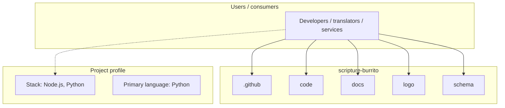
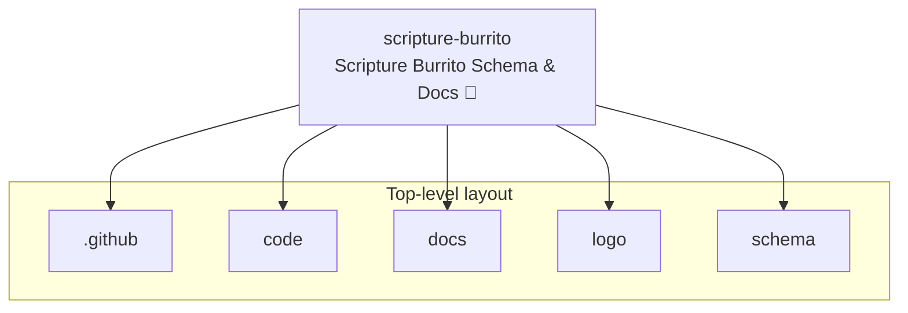
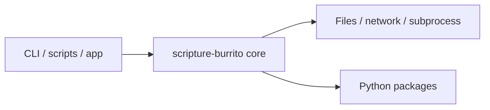

# scripture-burrito architecture

[Bible-Translation-Tools/scripture-burrito](https://github.com/Bible-Translation-Tools/scripture-burrito) — Scripture Burrito Schema & Docs 🌯.

This fork documents the Wycliffe Associates usage profile for Scripture Burrito and keeps the validation rules in sync with that profile.

## System context

## Repository structure

**Directories:** `.github`, `code`, `docs`, `logo`, `schema`

**Notable files:** `.gitignore`, `.nojekyll`, `.readthedocs.yaml`, `CNAME`, `CONTRIBUTORS`, `LICENSE`, `package-lock.json`, `package.json`, `README.md`, `requirements.txt`

## Runtime / integration sketch

> This diagram is inferred from repository layout, languages, and README. It is a starting map, not a full design review.

## Languages

| Language | Approx. file count |
|----------|-------------------|
| Python | 4 files |
| JavaScript | 2 files |
| Shell | 2 files |
| XSLT | 1 files |
| XML | 1 files |
| CSS | 1 files |
| Batch | 1 files |

## Design notes

| Topic | Detail |
|--------|--------|
| **Stack** | Node.js, Python |
| **Default branch** | `wycliffe-associates` |
| **Org** | Bible-Translation-Tools |

## Related

- Source: [Bible-Translation-Tools/scripture-burrito](https://github.com/Bible-Translation-Tools/scripture-burrito)
- Branch analyzed: `wycliffe-associates`
