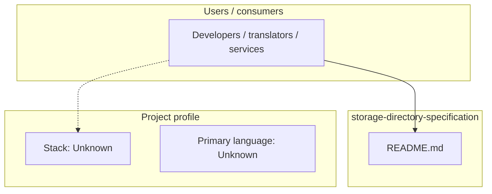
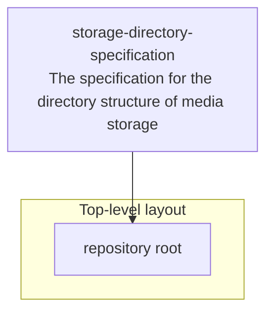

# storage-directory-specification architecture

[Bible-Translation-Tools/storage-directory-specification](https://github.com/Bible-Translation-Tools/storage-directory-specification) — The specification for the directory structure of media storage.

``` {LANGUAGE} -> {RESOURCE}

## System context



## Repository structure



**Notable files:** `README.md`


## Runtime / integration sketch


> This diagram is inferred from repository layout, languages, and README. It is a starting map, not a full design review.

## Languages

| Language | Approx. file count |
|----------|-------------------|
| — | — |

## Design notes

| Topic | Detail |
|--------|--------|
| **Stack** | Unknown |
| **Default branch** | `master` |
| **Org** | Bible-Translation-Tools |

## Related

- Source: [Bible-Translation-Tools/storage-directory-specification](https://github.com/Bible-Translation-Tools/storage-directory-specification)
- Branch analyzed: `master`
