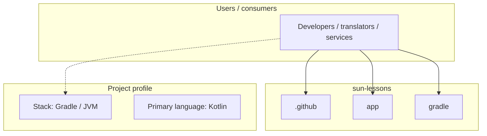
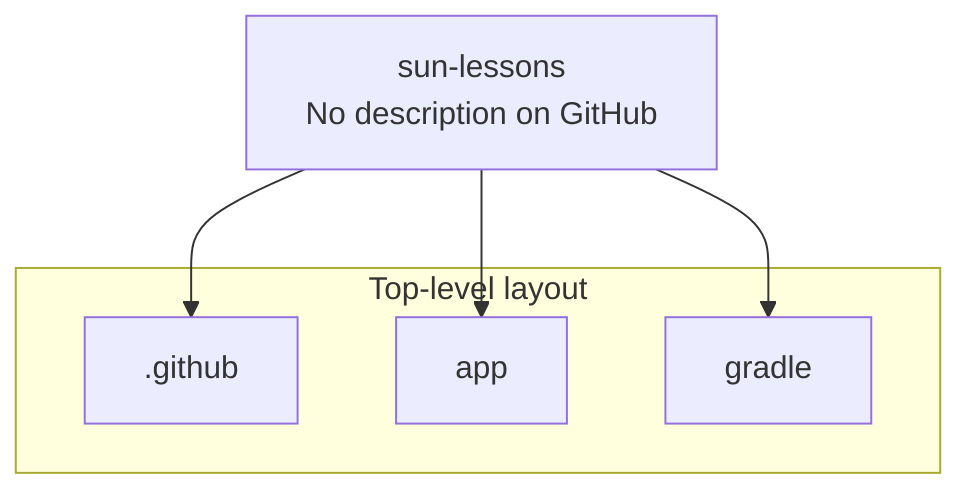
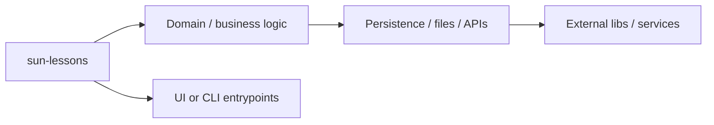

# sun-lessons architecture

[Bible-Translation-Tools/sun-lessons](https://github.com/Bible-Translation-Tools/sun-lessons) — _no GitHub description_.

It's an app learning SUN by flashcards.

## System context

## Repository structure

**Directories:** `.github`, `app`, `gradle`

**Notable files:** `.deepsource.toml`, `.gitignore`, `build.gradle.kts`, `gradle.properties`, `gradlew`, `gradlew.bat`, `LICENSE`, `README.md`, `settings.gradle.kts`

## Runtime / integration sketch

> This diagram is inferred from repository layout, languages, and README. It is a starting map, not a full design review.

## Languages

| Language | Approx. file count |
|----------|-------------------|
| Kotlin | 124 files |
| XML | 32 files |
| Batch | 1 files |

## Design notes

| Topic | Detail |
|--------|--------|
| **Stack** | Gradle / JVM |
| **Default branch** | `main` |
| **Org** | Bible-Translation-Tools |

## Related

- Source: [Bible-Translation-Tools/sun-lessons](https://github.com/Bible-Translation-Tools/sun-lessons)
- Branch analyzed: `main`
