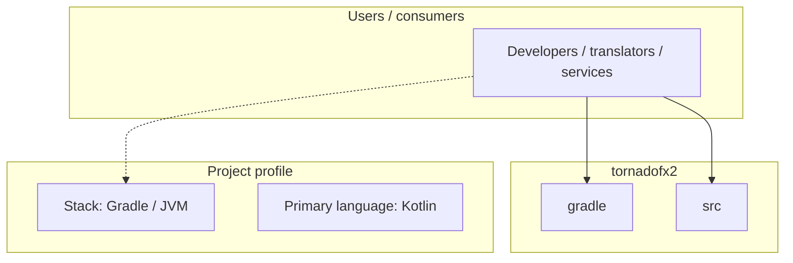
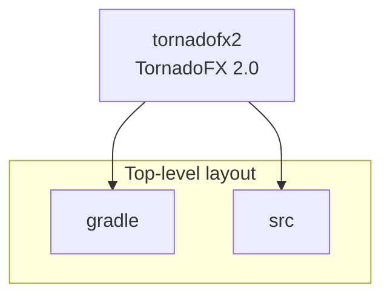
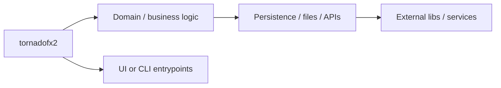

# tornadofx2 architecture

[Bible-Translation-Tools/tornadofx2](https://github.com/Bible-Translation-Tools/tornadofx2) — TornadoFX 2.0.

A JavaFX framework for Kotlin (Java 11+)

## System context

## Repository structure

**Directories:** `gradle`, `src`

**Notable files:** `.gitignore`, `.travis.yml`, `build.gradle`, `CHANGELOG.md`, `dependencies.gradle`, `gradle.properties`, `gradlew`, `gradlew.bat`, `LICENSE`, `README.md`, `settings.gradle`

## Runtime / integration sketch

> This diagram is inferred from repository layout, languages, and README. It is a starting map, not a full design review.

## Languages

| Language | Approx. file count |
|----------|-------------------|
| Kotlin | 150 files |
| CSS | 7 files |
| Java | 5 files |
| Gradle | 3 files |
| Batch | 1 files |

## Design notes

| Topic | Detail |
|--------|--------|
| **Stack** | Gradle / JVM |
| **Default branch** | `master` |
| **Org** | Bible-Translation-Tools |

## Related

- Source: [Bible-Translation-Tools/tornadofx2](https://github.com/Bible-Translation-Tools/tornadofx2)
- Branch analyzed: `master`
