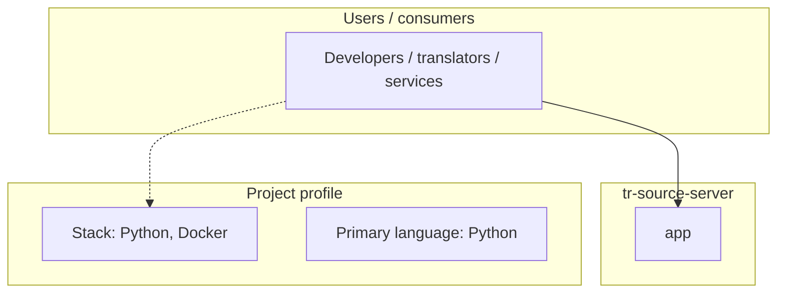
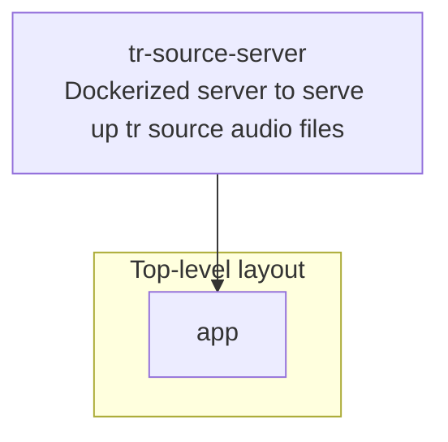
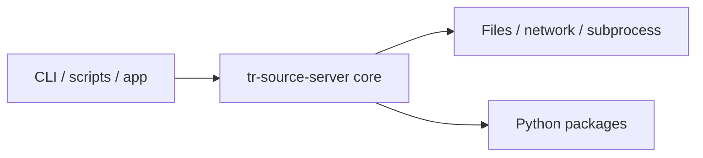

# tr-source-server architecture

[Bible-Translation-Tools/tr-source-server](https://github.com/Bible-Translation-Tools/tr-source-server) — Dockerized server to serve up tr source audio files.

Dockerized server to serve up tr source audio files

## System context

## Repository structure

**Directories:** `app`

**Notable files:** `.gitignore`, `Dockerfile`, `README.md`, `requirements.txt`

## Runtime / integration sketch

> This diagram is inferred from repository layout, languages, and README. It is a starting map, not a full design review.

## Languages

| Language | Approx. file count |
|----------|-------------------|
| Python | 2 files |

## Design notes

| Topic | Detail |
|--------|--------|
| **Stack** | Python, Docker |
| **Default branch** | `master` |
| **Org** | Bible-Translation-Tools |

## Related

- Source: [Bible-Translation-Tools/tr-source-server](https://github.com/Bible-Translation-Tools/tr-source-server)
- Branch analyzed: `master`
