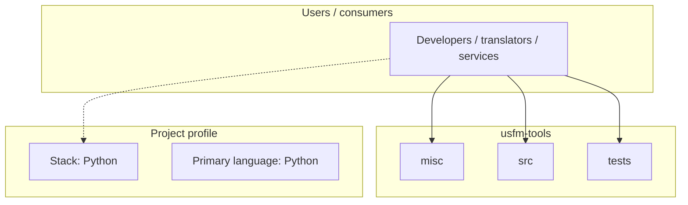
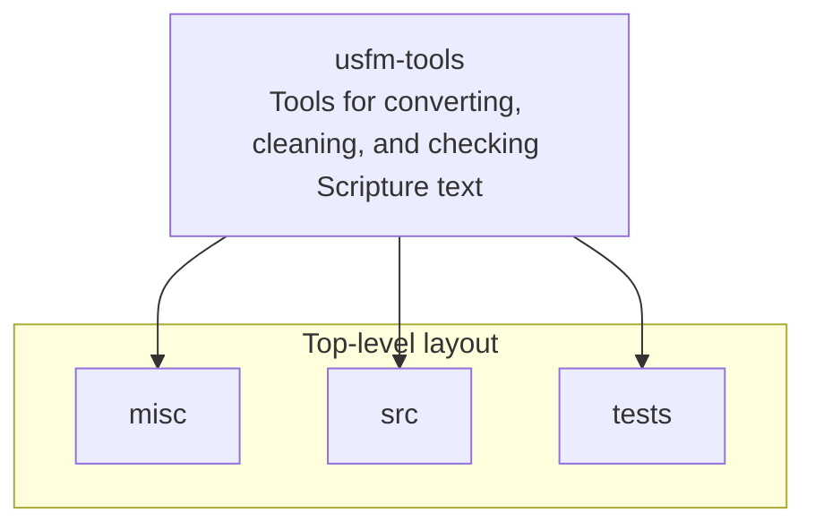

# usfm-tools architecture

[Bible-Translation-Tools/usfm-tools](https://github.com/Bible-Translation-Tools/usfm-tools) — Tools for converting, cleaning, and checking Scripture text.

Tools for converting, cleaning, and checking Scripture text

## System context

## Repository structure

**Directories:** `misc`, `src`, `tests`

**Notable files:** `.gitignore`, `README.md`

## Runtime / integration sketch

> This diagram is inferred from repository layout, languages, and README. It is a starting map, not a full design review.

## Languages

| Language | Approx. file count |
|----------|-------------------|
| Python | 89 files |

## Design notes

| Topic | Detail |
|--------|--------|
| **Stack** | Python |
| **Default branch** | `default` |
| **Org** | Bible-Translation-Tools |

## Related

- Source: [Bible-Translation-Tools/usfm-tools](https://github.com/Bible-Translation-Tools/usfm-tools)
- Branch analyzed: `default`
