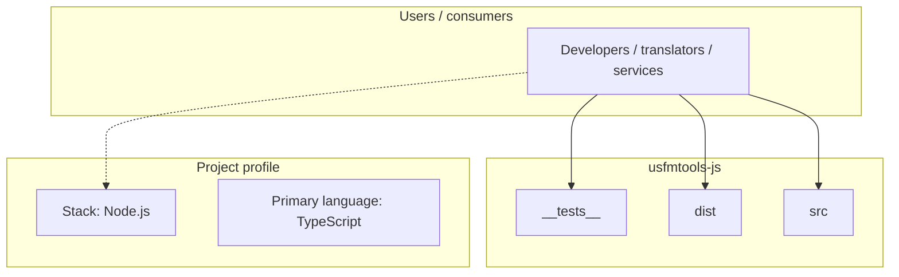
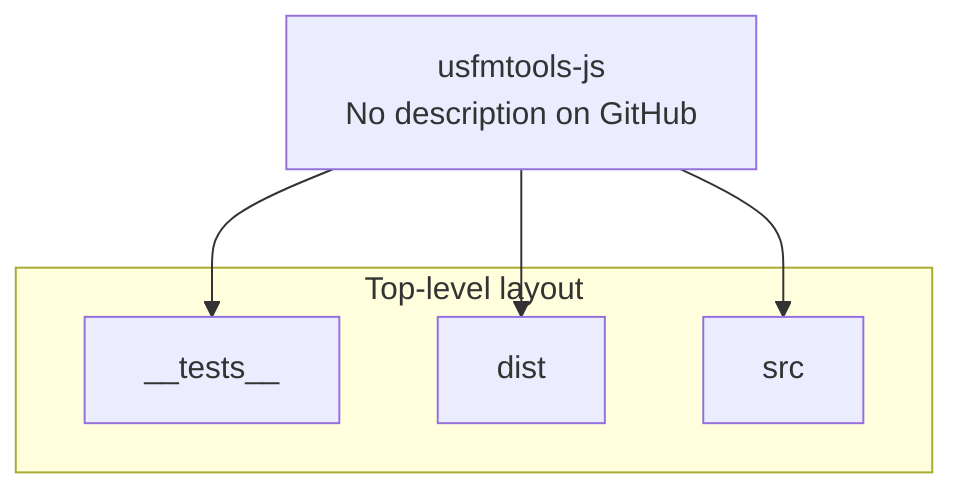
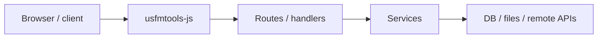

# usfmtools-js architecture

[Bible-Translation-Tools/usfmtools-js](https://github.com/Bible-Translation-Tools/usfmtools-js) — _no GitHub description_.

A TypeScript/JavaScript parser for [USFM](https://ubsicap.github.io/usfm/) (Unified Standard Format Markers), the standard encoding format for Scripture translations.

## System context

## Repository structure

**Directories:** `__tests__`, `dist`, `src`

**Notable files:** `.gitignore`, `.npmignore`, `jest.config.js`, `package-lock.json`, `package.json`, `README.md`, `tsconfig.json`

## Runtime / integration sketch

> This diagram is inferred from repository layout, languages, and README. It is a starting map, not a full design review.

## Languages

| Language | Approx. file count |
|----------|-------------------|
| TypeScript | 327 files |
| JavaScript | 164 files |

## Design notes

| Topic | Detail |
|--------|--------|
| **Stack** | Node.js |
| **Default branch** | `main` |
| **Org** | Bible-Translation-Tools |

## Related

- Source: [Bible-Translation-Tools/usfmtools-js](https://github.com/Bible-Translation-Tools/usfmtools-js)
- Branch analyzed: `main`
