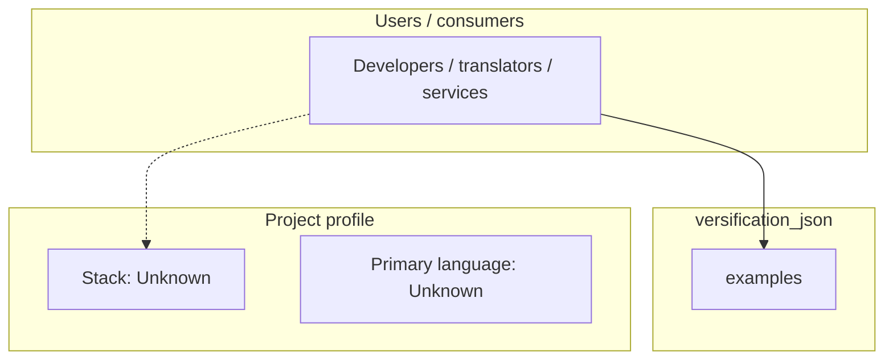
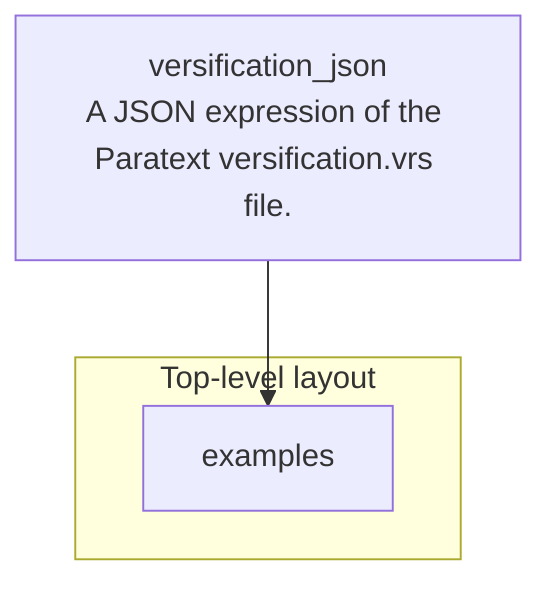

# versification_json architecture

[Bible-Translation-Tools/versification_json](https://github.com/Bible-Translation-Tools/versification_json) — A JSON expression of the Paratext versification.vrs file..

The aim is to find a JSON representation of the data currently stored in Paratext's versification.vrs file. The legacy format is character-based. The JSON representation is intended to be a fairly literal replacement for that file. The main non-syntactic changes are

## System context

## Repository structure

**Directories:** `examples`

**Notable files:** `LICENSE`, `README.md`, `versification_as_json.schema.json`

## Runtime / integration sketch

> This diagram is inferred from repository layout, languages, and README. It is a starting map, not a full design review.

## Languages

| Language | Approx. file count |
|----------|-------------------|
| — | — |

## Design notes

| Topic | Detail |
|--------|--------|
| **Stack** | Unknown |
| **Default branch** | `master` |
| **Org** | Bible-Translation-Tools |

## Related

- Source: [Bible-Translation-Tools/versification_json](https://github.com/Bible-Translation-Tools/versification_json)
- Branch analyzed: `master`
