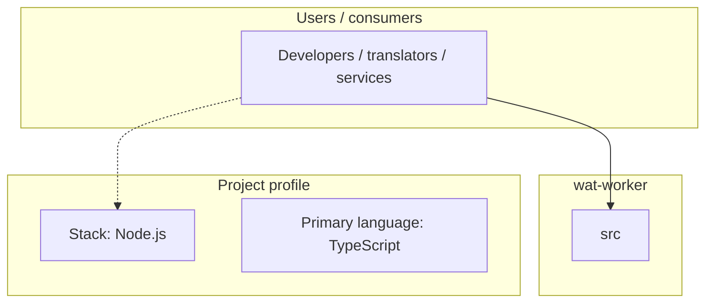
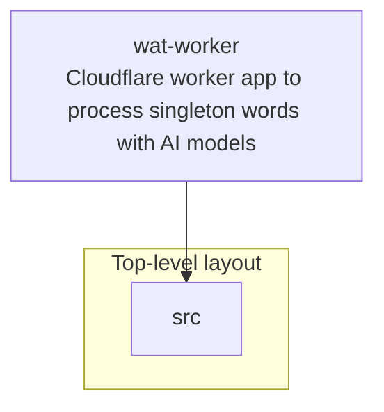
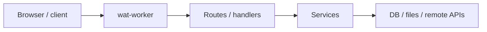

# wat-worker architecture

[Bible-Translation-Tools/wat-worker](https://github.com/Bible-Translation-Tools/wat-worker) — Cloudflare worker app to process singleton words with AI models.

``` npm install npm run dev ```

## System context



## Repository structure



**Directories:** `src`

**Notable files:** `.gitignore`, `package-lock.json`, `package.json`, `README.md`, `schema.sql`, `tsconfig.json`, `worker-configuration.d.ts`, `wrangler.jsonc`


## Runtime / integration sketch



> This diagram is inferred from repository layout, languages, and README. It is a starting map, not a full design review.

## Languages

| Language | Approx. file count |
|----------|-------------------|
| TypeScript | 3 files |
| SQL | 1 files |

## Design notes

| Topic | Detail |
|--------|--------|
| **Stack** | Node.js |
| **Default branch** | `main` |
| **Org** | Bible-Translation-Tools |

## Related

- Source: [Bible-Translation-Tools/wat-worker](https://github.com/Bible-Translation-Tools/wat-worker)
- Branch analyzed: `main`
