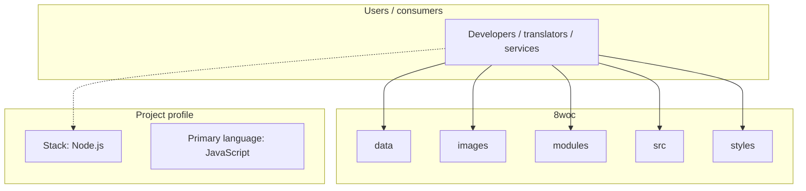
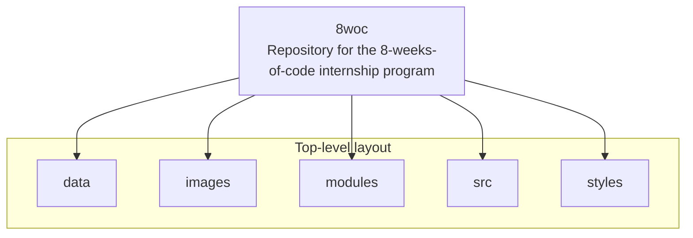
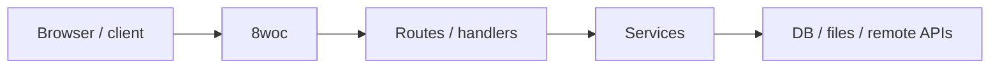

# 8woc architecture

[WycliffeAssociates/8woc](https://github.com/WycliffeAssociates/8woc) — Repository for the 8-weeks-of-code internship program.

Repository for the 8-weeks-of-code internship program

## System context

## Repository structure

**Directories:** `data`, `images`, `modules`, `src`, `styles`

**Notable files:** `.babelrc`, `.gitignore`, `API_Doc.md`, `index.html`, `main.js`, `package.json`, `README.md`, `requirements.js`

## Runtime / integration sketch

> This diagram is inferred from repository layout, languages, and README. It is a starting map, not a full design review.

## Languages

| Language | Approx. file count |
|----------|-------------------|
| JavaScript | 119 files |
| CSS | 4 files |
| HTML | 2 files |

## Design notes

| Topic | Detail |
|--------|--------|
| **Stack** | Node.js |
| **Default branch** | `develop` |
| **Org** | WycliffeAssociates |

## Related

- Source: [WycliffeAssociates/8woc](https://github.com/WycliffeAssociates/8woc)
- Branch analyzed: `develop`
