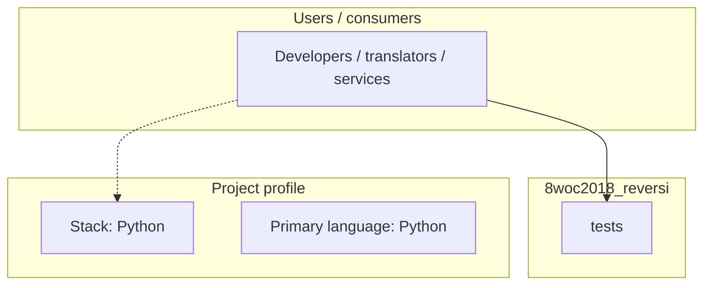
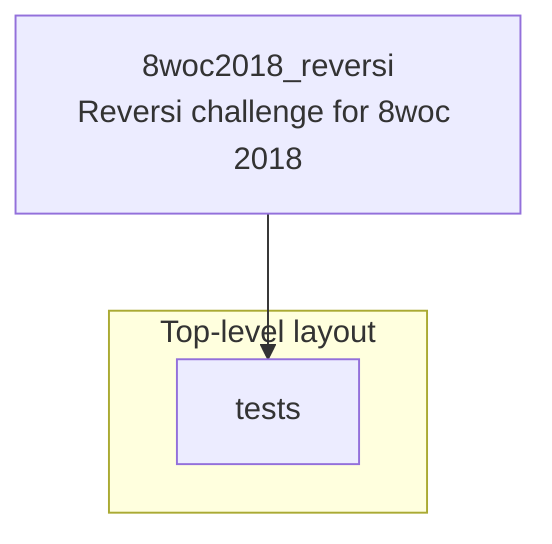
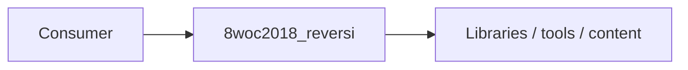

# 8woc2018_reversi architecture

[WycliffeAssociates/8woc2018_reversi](https://github.com/WycliffeAssociates/8woc2018_reversi) — Reversi challenge for 8woc 2018.

Reversi Challenge =================

## System context

## Repository structure

**Directories:** `tests`

**Notable files:** `.gitignore`, `example_input.json`, `example_output.json`, `example_solution_template.py`, `README.md`, `tester.py`

## Runtime / integration sketch

> This diagram is inferred from repository layout, languages, and README. It is a starting map, not a full design review.

## Languages

| Language | Approx. file count |
|----------|-------------------|
| Python | 3 files |

## Design notes

| Topic | Detail |
|--------|--------|
| **Stack** | Python |
| **Default branch** | `master` |
| **Org** | WycliffeAssociates |

## Related

- Source: [WycliffeAssociates/8woc2018_reversi](https://github.com/WycliffeAssociates/8woc2018_reversi)
- Branch analyzed: `master`
