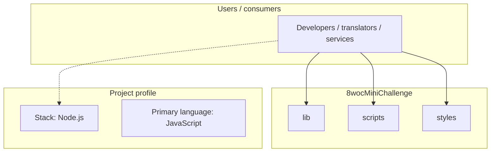
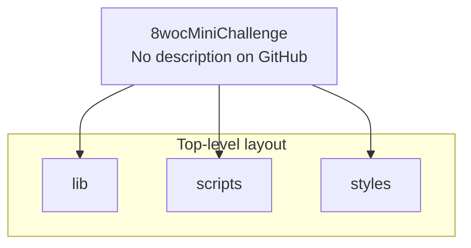
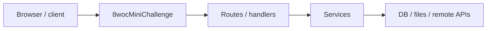

# 8wocMiniChallenge architecture

[WycliffeAssociates/8wocMiniChallenge](https://github.com/WycliffeAssociates/8wocMiniChallenge) — _no GitHub description_.

Requirements: - npm - Bower

## System context

## Repository structure

**Directories:** `lib`, `scripts`, `styles`

**Notable files:** `.gitignore`, `bower.json`, `gulpfile.js`, `index.html`, `package.json`, `README.md`

## Runtime / integration sketch

> This diagram is inferred from repository layout, languages, and README. It is a starting map, not a full design review.

## Languages

| Language | Approx. file count |
|----------|-------------------|
| JavaScript | 10 files |
| HTML | 1 files |
| CSS | 1 files |

## Design notes

| Topic | Detail |
|--------|--------|
| **Stack** | Node.js |
| **Default branch** | `master` |
| **Org** | WycliffeAssociates |

## Related

- Source: [WycliffeAssociates/8wocMiniChallenge](https://github.com/WycliffeAssociates/8wocMiniChallenge)
- Branch analyzed: `master`
