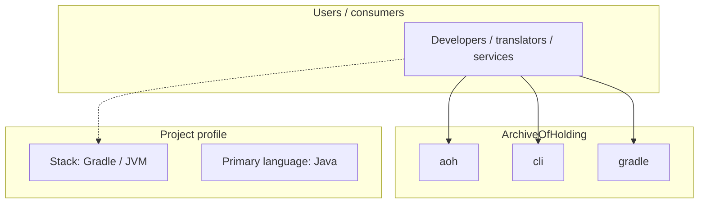
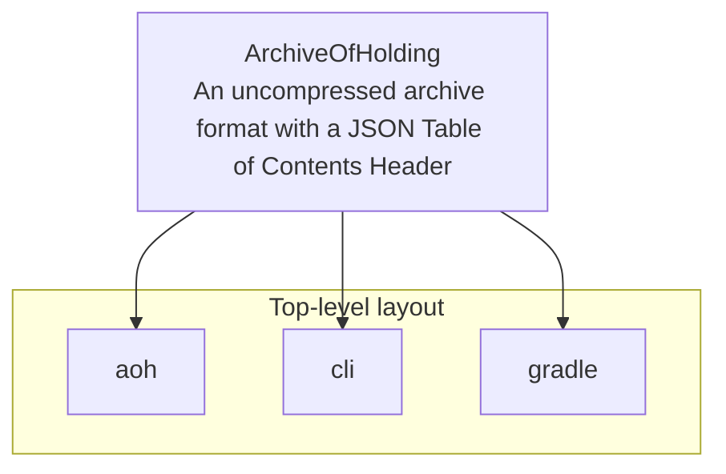
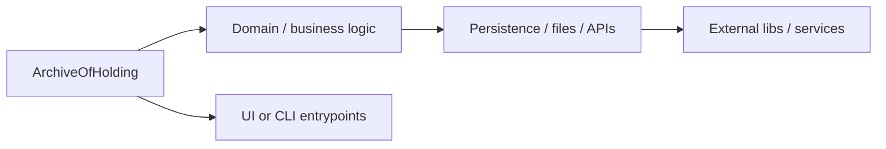

# ArchiveOfHolding architecture

[WycliffeAssociates/ArchiveOfHolding](https://github.com/WycliffeAssociates/ArchiveOfHolding) — An uncompressed archive format with a JSON Table of Contents Header.

An uncompressed archive format with a JSON Table of Contents Header

## System context

## Repository structure

**Directories:** `aoh`, `cli`, `gradle`

**Notable files:** `.gitattributes`, `.gitignore`, `build.gradle`, `gradlew`, `gradlew.bat`, `LICENSE`, `settings.gradle`

## Runtime / integration sketch

> This diagram is inferred from repository layout, languages, and README. It is a starting map, not a full design review.

## Languages

| Language | Approx. file count |
|----------|-------------------|
| Java | 6 files |
| Gradle | 4 files |
| Batch | 1 files |

## Design notes

| Topic | Detail |
|--------|--------|
| **Stack** | Gradle / JVM |
| **Default branch** | `master` |
| **Org** | WycliffeAssociates |

## Related

- Source: [WycliffeAssociates/ArchiveOfHolding](https://github.com/WycliffeAssociates/ArchiveOfHolding)
- Branch analyzed: `master`
