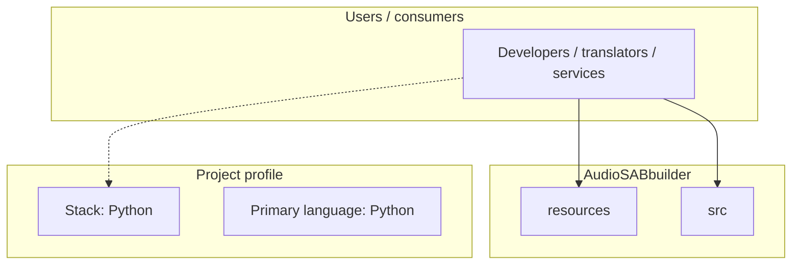
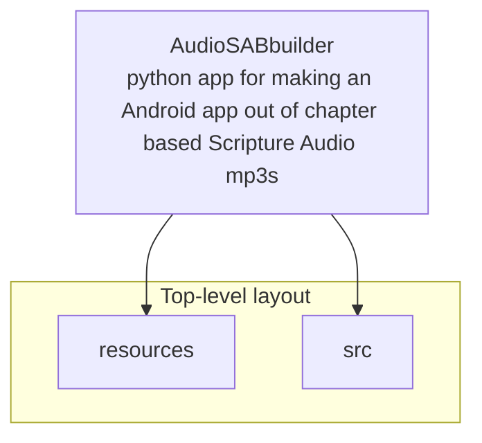
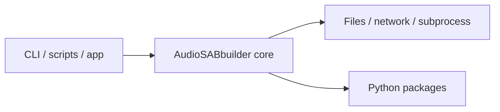

# AudioSABbuilder architecture

[WycliffeAssociates/AudioSABbuilder](https://github.com/WycliffeAssociates/AudioSABbuilder) — python app for making an Android app out of chapter based Scripture Audio mp3s.

python app for making an Android app out of chapter based Scripture Audio mp3s

## System context

## Repository structure

**Directories:** `resources`, `src`

**Notable files:** `.gitattributes`, `.gitignore`, `LICENSE`, `README.md`, `requirements.txt`

## Runtime / integration sketch

> This diagram is inferred from repository layout, languages, and README. It is a starting map, not a full design review.

## Languages

| Language | Approx. file count |
|----------|-------------------|
| Python | 6 files |

## Design notes

| Topic | Detail |
|--------|--------|
| **Stack** | Python |
| **Default branch** | `master` |
| **Org** | WycliffeAssociates |

## Related

- Source: [WycliffeAssociates/AudioSABbuilder](https://github.com/WycliffeAssociates/AudioSABbuilder)
- Branch analyzed: `master`
