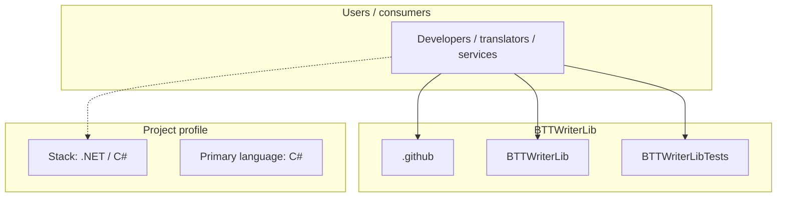
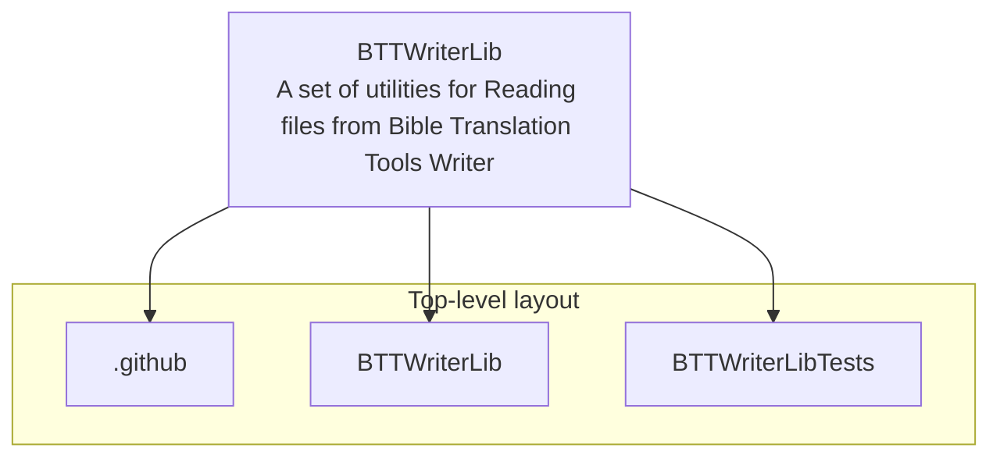
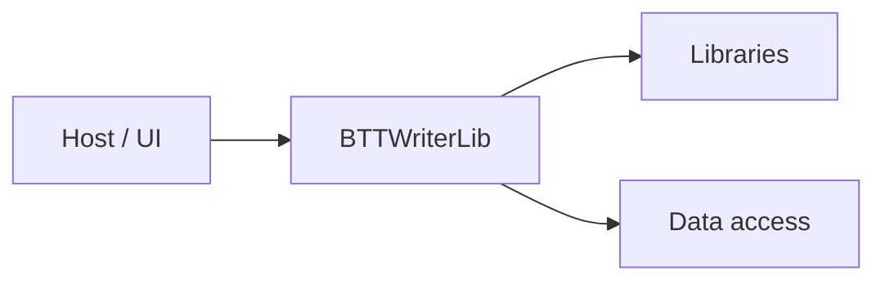

# BTTWriterLib architecture

[WycliffeAssociates/BTTWriterLib](https://github.com/WycliffeAssociates/BTTWriterLib) — A set of utilities for Reading files from Bible Translation Tools Writer.

A set of utilities for Reading files from Bible Translation Tools Writer

## System context

## Repository structure

**Directories:** `.github`, `BTTWriterLib`, `BTTWriterLibTests`

**Notable files:** `.gitignore`, `BTTWriterLib.sln`, `LICENSE`, `README.md`

## Runtime / integration sketch

> This diagram is inferred from repository layout, languages, and README. It is a starting map, not a full design review.

## Languages

| Language | Approx. file count |
|----------|-------------------|
| C# | 14 files |

## Design notes

| Topic | Detail |
|--------|--------|
| **Stack** | .NET / C# |
| **Default branch** | `master` |
| **Org** | WycliffeAssociates |

## Related

- Source: [WycliffeAssociates/BTTWriterLib](https://github.com/WycliffeAssociates/BTTWriterLib)
- Branch analyzed: `master`
