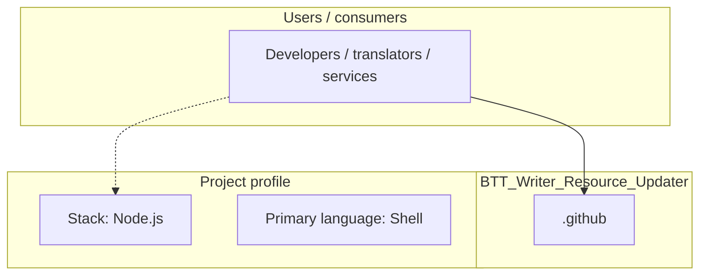
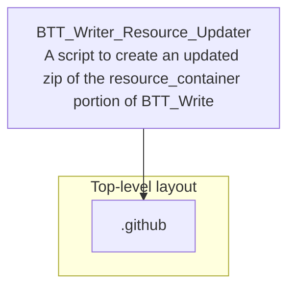

# BTT_Writer_Resource_Updater architecture

[WycliffeAssociates/BTT_Writer_Resource_Updater](https://github.com/WycliffeAssociates/BTT_Writer_Resource_Updater) — A script to create an updated zip of the resource_container portion of BTT_Writer.

A script to create an updated zip of the resource_container portion of BTT_Writer

## System context

## Repository structure

**Directories:** `.github`

**Notable files:** `.gitignore`, `btt_writer_resource_update.sh`, `package.json`, `README.md`

## Runtime / integration sketch

> This diagram is inferred from repository layout, languages, and README. It is a starting map, not a full design review.

## Languages

| Language | Approx. file count |
|----------|-------------------|
| Shell | 1 files |

## Design notes

| Topic | Detail |
|--------|--------|
| **Stack** | Node.js |
| **Default branch** | `master` |
| **Org** | WycliffeAssociates |

## Related

- Source: [WycliffeAssociates/BTT_Writer_Resource_Updater](https://github.com/WycliffeAssociates/BTT_Writer_Resource_Updater)
- Branch analyzed: `master`
