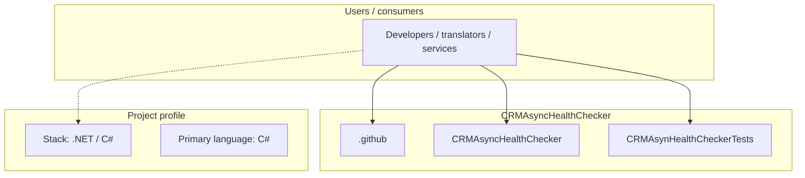
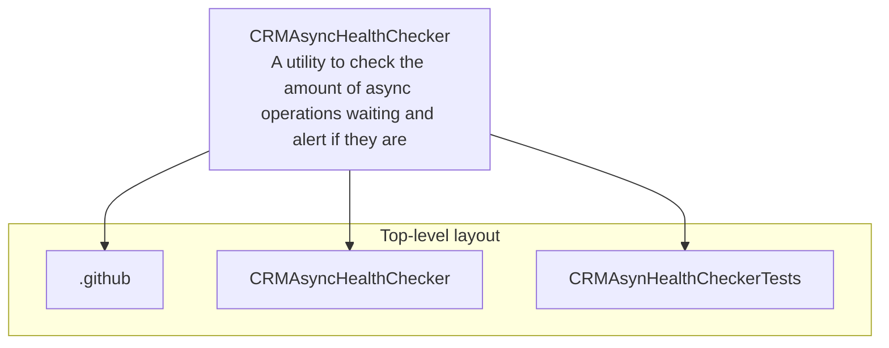
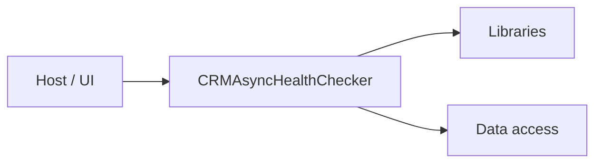

# CRMAsyncHealthChecker architecture

[WycliffeAssociates/CRMAsyncHealthChecker](https://github.com/WycliffeAssociates/CRMAsyncHealthChecker) — A utility to check the amount of async operations waiting and alert if they are above a limit.

A utility to check the amount of async operations waiting in Microsoft Dataverse (formerly Dynamics 365/CRM) and alert if they are above a limit.

## System context

## Repository structure

**Directories:** `.github`, `CRMAsyncHealthChecker`, `CRMAsynHealthCheckerTests`

**Notable files:** `.gitignore`, `CRMAsyncHealthChecker.sln`, `LICENSE`, `README.md`

## Runtime / integration sketch

> This diagram is inferred from repository layout, languages, and README. It is a starting map, not a full design review.

## Languages

| Language | Approx. file count |
|----------|-------------------|
| C# | 7 files |

## Design notes

| Topic | Detail |
|--------|--------|
| **Stack** | .NET / C# |
| **Default branch** | `master` |
| **Org** | WycliffeAssociates |

## Related

- Source: [WycliffeAssociates/CRMAsyncHealthChecker](https://github.com/WycliffeAssociates/CRMAsyncHealthChecker)
- Branch analyzed: `master`
