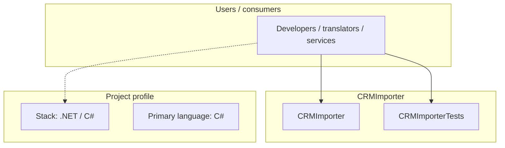
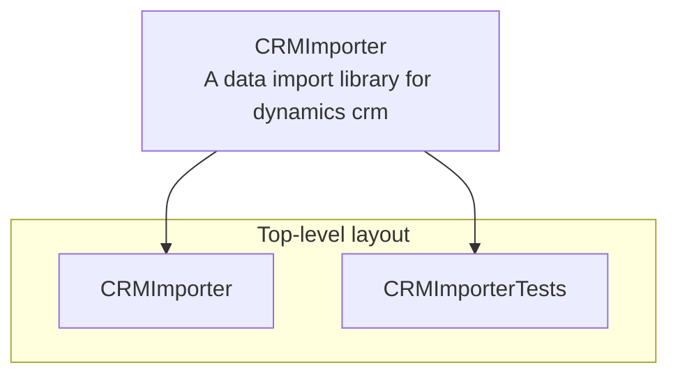
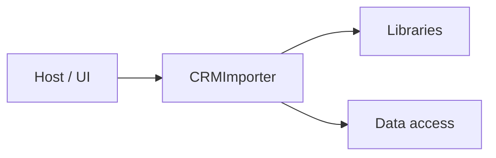

# CRMImporter architecture

[WycliffeAssociates/CRMImporter](https://github.com/WycliffeAssociates/CRMImporter) — A data import library for dynamics crm.

A data import library for dynamics crm

## System context

## Repository structure

**Directories:** `CRMImporter`, `CRMImporterTests`

**Notable files:** `.gitignore`, `CRMImporter.sln`, `LICENSE`, `README.md`

## Runtime / integration sketch

> This diagram is inferred from repository layout, languages, and README. It is a starting map, not a full design review.

## Languages

| Language | Approx. file count |
|----------|-------------------|
| C# | 21 files |

## Design notes

| Topic | Detail |
|--------|--------|
| **Stack** | .NET / C# |
| **Default branch** | `master` |
| **Org** | WycliffeAssociates |

## Related

- Source: [WycliffeAssociates/CRMImporter](https://github.com/WycliffeAssociates/CRMImporter)
- Branch analyzed: `master`
